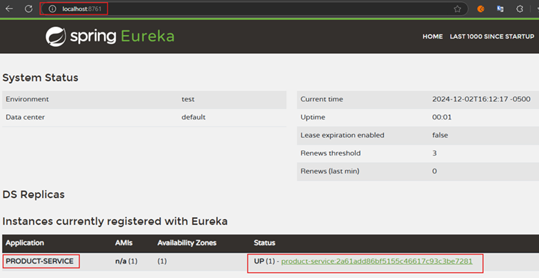

# Sección 04: Eureka Discovery

---

## Dependencias

````xml
<!--Spring Boot 3.4.0-->
<!--Spring Cloud 2024.0.0-->
<!--Java 21-->
<dependencies>
    <dependency>
        <groupId>org.springframework.cloud</groupId>
        <artifactId>spring-cloud-starter-netflix-eureka-server</artifactId>
    </dependency>

    <dependency>
        <groupId>org.springframework.boot</groupId>
        <artifactId>spring-boot-starter-test</artifactId>
        <scope>test</scope>
    </dependency>
</dependencies>
````

Más adelante nos aparecerá el siguiente mensaje cuando ejecutemos este `discovery-server`.

````
Standard Commons Logging discovery in action with spring-jcl: please remove commons-logging.jar from classpath in order to avoid potential conflicts
````

Lo que nos está diciendo es que para evitar un posible conflicto debemos eliminar o excluir la dependencia
`commons-logging.jar`. Ahora, para ver qué dependencia está haciendo uso del `commons-logging.jar` ejecutamos el
siguiente comando `mvnw dependency:tree` con el que listaremos todas las dependencias principales y transitivas.

Si luego buscamos el `commons-logging.jar` vemos que está contenida en la dependencia
`spring-cloud-netflix-eureka-server`.

````bash
M:\PERSONAL\PROGRAMACION\DESARROLLO_JAVA_SPRING\01.udemy\05.sergey_kargopolov\event-driven-cqrs-saga-axon-microservices\discovery-server (main -> origin)
$ mvnw dependency:tree

[INFO] Scanning for projects...
[INFO]
[INFO] -------------------< dev.magadiflo:discovery-server >-------------------
[INFO] Building discovery-server 0.0.1-SNAPSHOT
[INFO]   from pom.xml
[INFO] --------------------------------[ jar ]---------------------------------
[INFO]
[INFO] --- dependency:3.8.1:tree (default-cli) @ discovery-server ---
[INFO] dev.magadiflo:discovery-server:jar:0.0.1-SNAPSHOT
[INFO] +- org.springframework.cloud:spring-cloud-starter-netflix-eureka-server:jar:4.2.0-RC1:compile
[INFO] |  +- org.springframework.cloud:spring-cloud-starter:jar:4.2.0-RC1:compile
[INFO] |  |  +- org.springframework.cloud:spring-cloud-context:jar:4.2.0-RC1:compile
[INFO] |  |  |  \- org.springframework.security:spring-security-crypto:jar:6.4.1:compile
[INFO] |  |  +- org.springframework.cloud:spring-cloud-commons:jar:4.2.0-RC1:compile
[INFO] |  |  \- org.bouncycastle:bcprov-jdk18on:jar:1.78.1:compile
[INFO] |  +- org.springframework.cloud:spring-cloud-netflix-eureka-server:jar:4.2.0-RC1:compile
...
[INFO] |  |  +- org.springframework.cloud:spring-cloud-netflix-eureka-client:jar:4.2.0-RC1:compile
[INFO] |  |  |  +- com.netflix.eureka:eureka-client:jar:2.0.4:compile
...
[INFO] |  |  |  |  +- javax.annotation:javax.annotation-api:jar:1.2:runtime
[INFO] |  |  |  |  \- org.codehaus.jettison:jettison:jar:1.5.4:runtime
[INFO] |  |  |  \- org.apache.httpcomponents.client5:httpclient5:jar:5.4.1:compile
[INFO] |  |  |     +- org.apache.httpcomponents.core5:httpcore5:jar:5.3.1:compile
[INFO] |  |  |     \- org.apache.httpcomponents.core5:httpcore5-h2:jar:5.3.1:compile
[INFO] |  |  +- com.netflix.eureka:eureka-client-jersey3:jar:2.0.4:compile
[INFO] |  |  |  \- org.glassfish.jersey.connectors:jersey-apache-connector:jar:3.1.9:compile
[INFO] |  |  |     +- commons-codec:commons-codec:jar:1.17.1:compile
[INFO] |  |  |     \- commons-logging:commons-logging:jar:1.3.3:compile
...
[INFO]    \- org.xmlunit:xmlunit-core:jar:2.10.0:test
[INFO] ------------------------------------------------------------------------
[INFO] BUILD SUCCESS
[INFO] ------------------------------------------------------------------------
[INFO] Total time:  3.303 s
[INFO] Finished at: 2024-12-02T15:02:00-05:00
[INFO] ------------------------------------------------------------------------
````

Por lo tanto, para evitar que nos salga el mensaje de advertencia debemos excluir la dependencia `commons-logging` de
la dependencia `spring-cloud-starter-netflix-eureka-server`, tal como se muestra a continuación.

````xml

<dependency>
    <groupId>org.springframework.cloud</groupId>
    <artifactId>spring-cloud-starter-netflix-eureka-server</artifactId>
    <exclusions>
        <exclusion>
            <groupId>commons-logging</groupId>
            <artifactId>commons-logging</artifactId>
        </exclusion>
    </exclusions>
</dependency>
````

## Configura proyecto como un Eureka Server

Para decirle a Spring Boot que este proyecto será un Servidor de Eureka, debemos agregar la siguiente anotación en
la clase principal del proyecto.

````java

@EnableEurekaServer
@SpringBootApplication
public class DiscoveryServerApplication {

    public static void main(String[] args) {
        SpringApplication.run(DiscoveryServerApplication.class, args);
    }

}
````

Luego, en el `application.yml` agregamos la siguiente configuración propia del servidor de eureka.

````yml
server:
  port: 8761
  error:
    include-message: always

spring:
  application:
    name: discovery-server

eureka:
  instance:
    hostname: localhost

  client:
    register-with-eureka: false
    fetch-registry: false
    service-url:
      defaultZone: http://${eureka.instance.hostname}:${server.port}/eureka/
````

## Registra microservicio product-service con Eureka

Para que nuestro microservicio `product-service` sea un cliente de `eureka` vamos a agregar la siguiente dependencia.

````xml
<!--Spring Boot 3.4.0-->
<!--Java 21-->
<!--Spring Cloud 2024.0.0-->
<project>
    <dependencies>
        <dependency>
            <groupId>org.springframework.cloud</groupId>
            <artifactId>spring-cloud-starter-netflix-eureka-client</artifactId>
        </dependency>
    </dependencies>
    <dependencyManagement>
        <dependencies>
            <dependency>
                <groupId>org.springframework.cloud</groupId>
                <artifactId>spring-cloud-dependencies</artifactId>
                <version>${spring-cloud.version}</version>
                <type>pom</type>
                <scope>import</scope>
            </dependency>
        </dependencies>
    </dependencyManagement>

    <build>
        <plugins>
            <plugin>
                <groupId>org.springframework.boot</groupId>
                <artifactId>spring-boot-maven-plugin</artifactId>
            </plugin>
        </plugins>
    </build>
    <repositories>
        <repository>
            <id>spring-milestones</id>
            <name>Spring Milestones</name>
            <url>https://repo.spring.io/milestone</url>
            <snapshots>
                <enabled>false</enabled>
            </snapshots>
        </repository>
    </repositories>

</project>
````

**Nota**
> Tan solo agregando la dependencia de `spring-cloud-starter-netflix-eureka-client` habilitamos en automático este
> servicio como un cliente de eureka. Es decir, no necesitamos agregar la anotación `@EnableDiscoveryClient` en la
> clase principal para que este servicio sea un cliente de eureka, simplemente agregando la dependencia es suficiente.

A continuación, agregamos las siguientes configuraciones en el `application.yml`.

````yml
server:
  port: 0
  error:
    include-message: always

spring:
  application:
    name: product-service

eureka:
  instance:
    hostname: localhost
    instance-id: ${spring.application.name}:${random.value}

  client:
    service-url:
      defaultZone: http://localhost:8761/eureka/
````

Con el `server.port=0` estamos configurando un puerto aleatorio para este servicio. No necesitamos establecer un puerto
fijo, dado que usaremos precisamente `Eureka` para que descubra la dirección de este servicio, de una instancia o de
las múltiples instancias que se puedan crear de este servicio.

## Probando Eureka Server y Product Service como cliente de Eureka

Ejecutamos nuestro `Eureka Server` y a continuación ejecutamos el `product-service`. Ingresamos a la url
`http://localhost:8761` y observamos que nuestro cliente se ha registrado correctamente en `Eureka Server`.

