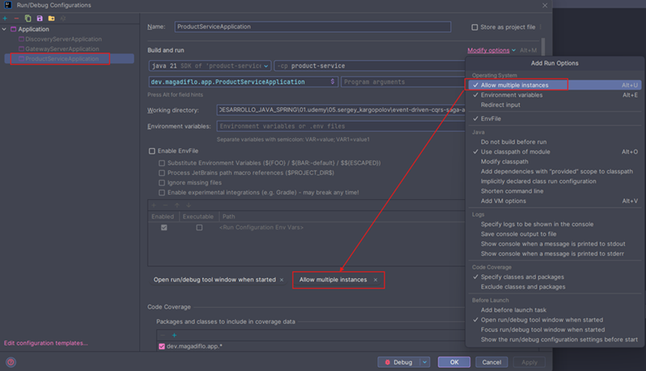
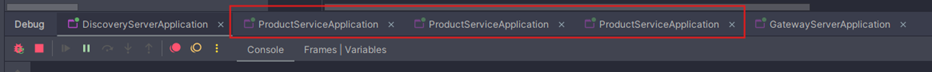

# Sección 05: Spring Cloud API Gateway & Load Balancing

---

## Dependencias

````xml
<!--Spring Boot 3.4.0-->
<!--Java 21-->
<!--Spring Cloud 2024.0.0-RC1-->
<project>
    <dependencies>
        <dependency>
            <groupId>org.springframework.cloud</groupId>
            <artifactId>spring-cloud-starter-gateway</artifactId>
        </dependency>
        <dependency>
            <groupId>org.springframework.cloud</groupId>
            <artifactId>spring-cloud-starter-netflix-eureka-client</artifactId>
        </dependency>

        <dependency>
            <groupId>org.springframework.boot</groupId>
            <artifactId>spring-boot-starter-test</artifactId>
            <scope>test</scope>
        </dependency>
        <dependency>
            <groupId>io.projectreactor</groupId>
            <artifactId>reactor-test</artifactId>
            <scope>test</scope>
        </dependency>
    </dependencies>
    <dependencyManagement>
        <dependencies>
            <dependency>
                <groupId>org.springframework.cloud</groupId>
                <artifactId>spring-cloud-dependencies</artifactId>
                <version>${spring-cloud.version}</version>
                <type>pom</type>
                <scope>import</scope>
            </dependency>
        </dependencies>
    </dependencyManagement>

    <build>
        <plugins>
            <plugin>
                <groupId>org.springframework.boot</groupId>
                <artifactId>spring-boot-maven-plugin</artifactId>
            </plugin>
        </plugins>
    </build>
    <repositories>
        <repository>
            <id>spring-milestones</id>
            <name>Spring Milestones</name>
            <url>https://repo.spring.io/milestone</url>
            <snapshots>
                <enabled>false</enabled>
            </snapshots>
        </repository>
    </repositories>

</project>
````

## Configura Gateway Server

Agregamos las siguientes configuraciones en el `application.yml`.

````yml
server:
  port: 8080
  error:
    include-message: always

spring:
  application:
    name: gateway-server

eureka:
  instance:
    hostname: localhost

  client:
    service-url:
      defaultZone: http://localhost:8761/eureka/
````

## Mapeo manual de rutas mediante el descubrimiento de servicios

````yml
spring:
  cloud:
    gateway:
      routes:
        - id: product-service-route
          uri: lb://product-service
          predicates:
            - Path=/api/v1/products/**
````

## Múltiples instancias del product-service

Recordemos que una de las configuraciones que agregamos al `application.yml` del `product-service` fue el
`server.port=0`, esto permite generar un puerto aleatorio cuando se inicie una instancia de la aplicación. Ahora, como
vamos a querer ejecutar varias instancias utilizando nuestro IDE `IntelliJ IDEA`, además de agregar la configuración
anterior debemos habilitar la opción `Allow multiple instances` tal como se ve en la siguiente imagen.



Ahora, podemos ejecutar nuestras aplicaciones en el siguiente orden.

1. discovery-server
2. product-service (3 instancias)
3. gateway-server



## Probando cómo trabaja el load balancing

Luego de tener nuestras aplicaciones levantadas con las 3 instancias del `product-service`, lo que haremos será realizar
peticiones a nuestro microservicio `product-service` a través del `gateway-server`.

Como se observa en el resultado, el `load balancer` está equilibrando las peticiones, dado que en
cada una de ellas recibimos un puerto distinto correspondiente al microservicio que procesó la petición.

````bash
$ curl -v http://localhost:8080/api/v1/products
>
< HTTP/1.1 200 OK
< Content-Type: text/plain;charset=UTF-8
< Content-Length: 23
< Date: Tue, 03 Dec 2024 14:59:19 GMT
<
[58654]HTTP GET Handled* Connection #0 to host localhost left intact
````

````bash
$ curl -v http://localhost:8080/api/v1/products
>
< HTTP/1.1 200 OK
< Content-Type: text/plain;charset=UTF-8
< Content-Length: 23
< Date: Tue, 03 Dec 2024 14:59:26 GMT
<
[58693]HTTP GET Handled* Connection #0 to host localhost left intact
````

````bash
$ curl -v http://localhost:8080/api/v1/products
>
< HTTP/1.1 200 OK
< Content-Type: text/plain;charset=UTF-8
< Content-Length: 23
< Date: Tue, 03 Dec 2024 14:59:35 GMT
<
[58676]HTTP GET Handled* Connection #0 to host localhost left intact
````
