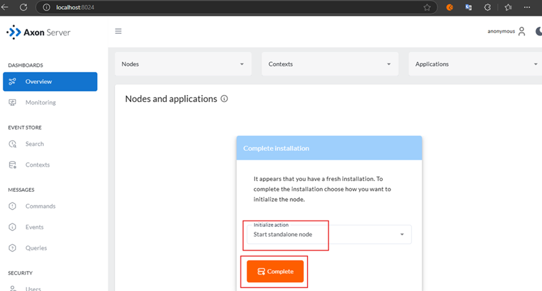
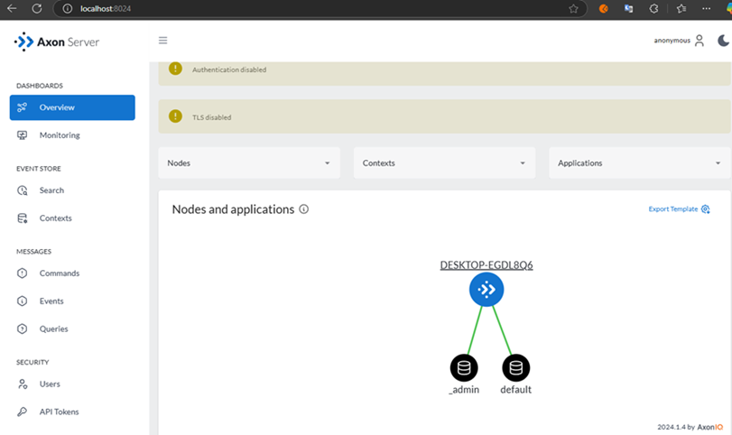
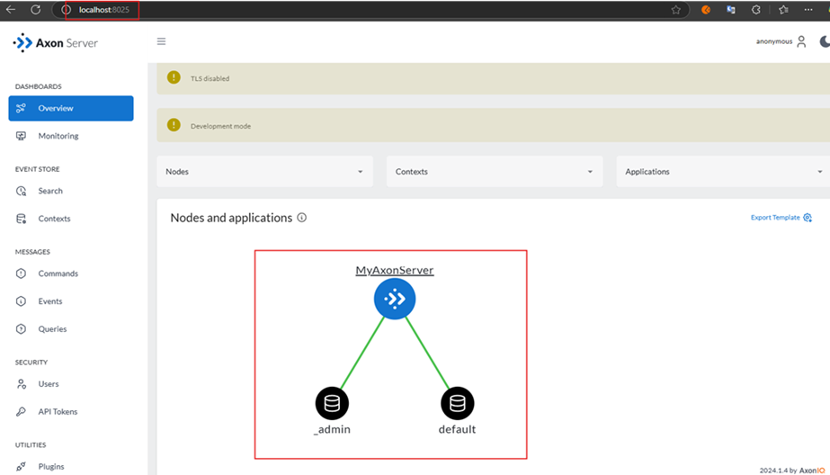

# Sección 06: Axon Server

#### Enrutamiento de mensajes y almacenamiento de eventos sin necesidad de configuración

---

`Axon Server` es nuestro sistema de almacenamiento de eventos y entrega de mensajes, escalable, altamente disponible y
diseñado a medida. Coordina la comunicación entre los componentes, teniendo en cuenta las expectativas para cada tipo de
mensaje: `comandos`, `eventos` y `consultas`. Esto permite que los sistemas evolucionen a medida que cambian sus
necesidades funcionales o técnicas.

## Descargue y ejecute Axon Server como una aplicación JAR

Dar click en el siguiente enlace
para [descargar el jar del Axon Server](https://www.axoniq.io/download/axon-server-releases/qs44pxaj2oamebrc).
Buscaremos la última versión existente. En mi caso se descargará la versión siguiente en un comprimido
`AxonServer-2024.1.4.zip`.

Luego de tener el zip descargado, lo voy a descomprimir en el directorio principal de este proyecto y renombrar el
directorio extraído por `axon-server-2024.1.4`. A continuación, en el archivo `.gitignore` agregaremos este directorio
para que git no lo tenga mapeado.

````gitignore
axon-server-2024.1.4/
````

Si listamos el directorio `axon-server-2024.1.4` veremos los siguientes archivos.

````bash
M:\PERSONAL\PROGRAMACION\DESARROLLO_JAVA_SPRING\01.udemy\05.sergey_kargopolov\event-driven-cqrs-saga-axon-microservices\axon-server-2024.1.4 (main -> origin)
$ ls -l

total 203868
-rwxr-xr-x 1 USUARIO 197121 127267541 Oct  9 11:39 axonserver.jar*
-rw-r--r-- 1 USUARIO 197121      4738 Oct  9 11:30 axonserver.properties
-rwxr-xr-x 1 USUARIO 197121   4225745 Oct  9 11:39 axonserver-cli.jar*
-rwxr-xr-x 1 USUARIO 197121  63415178 Oct  9 11:39 axonserver-migration.jar*
-rw-r--r-- 1 USUARIO 197121  13812967 Oct  9 11:39 controldb-migration.jar
drwxr-xr-x 1 USUARIO 197121         0 Dec  3 11:22 data/
drwxr-xr-x 1 USUARIO 197121         0 Oct  9 11:39 extensions/
drwxr-xr-x 1 USUARIO 197121         0 Dec  3 11:22 log/
drwxr-xr-x 1 USUARIO 197121         0 Dec  3 11:22 plugins/
-rw-r--r-- 1 USUARIO 197121     12497 Oct  9 11:30 README.txt
-rw-r--r-- 1 USUARIO 197121      2146 Oct  9 11:30 upgrade-instructions.txt
````

Para ejecutar el `jar`, nos posicionamos en el directorio `axon-server-2024.1.4` y usamos el comando que normalmente
usamos para ejecutar un `jar`.

````bash
M:\PERSONAL\PROGRAMACION\DESARROLLO_JAVA_SPRING\01.udemy\05.sergey_kargopolov\event-driven-cqrs-saga-axon-microservices\axon-server-2024.1.4 (main -> origin)
$ java -jar axonserver.jar
     _                     ____
    / \   __  _____  _ __ / ___|  ___ _ ____   _____ _ __
   / _ \  \ \/ / _ \| '_ \\___ \ / _ \ '__\ \ / / _ \ '__|
  / ___ \  >  < (_) | | | |___) |  __/ |   \ V /  __/ |
 /_/   \_\/_/\_\___/|_| |_|____/ \___|_|    \_/ \___|_|
 2024.1.4                      Powered by AxonIQ

2024-12-03 11:26:03.424  INFO 14380 --- [           main] io.axoniq.axonserver.AxonServer          : Starting AxonServer using Java 21.0.1 on DESKTOP-EGDL8Q6 with PID 14380 (M:\PERSONAL\PROGRAMACION\DESARROLLO_JAVA_SPRING\01.udemy\05.sergey_kargopolov\event-driven-cqrs-saga-axon-microservices\axon-server-2024.1.4\axonserver.jar started by USUARIO in M:\PERSONAL\PROGRAMACION\DESARROLLO_JAVA_SPRING\01.udemy\05.sergey_kargopolov\event-driven-cqrs-saga-axon-microservices\axon-server-2024.1.4)
2024-12-03 11:26:03.436  INFO 14380 --- [           main] io.axoniq.axonserver.AxonServer          : No active profile set, falling back to 1 default profile: "default"
2024-12-03 11:26:09.832  INFO 14380 --- [           main] o.s.b.w.embedded.tomcat.TomcatWebServer  : Tomcat initialized with port(s): 8024 (http)
2024-12-03 11:26:10.136  INFO 14380 --- [           main] A.i.a.a.c.MessagingPlatformConfiguration : Configuration initialized with SSL DISABLED and access control DISABLED.
2024-12-03 11:26:15.424  INFO 14380 --- [           main] io.axoniq.axonserver.AxonServer          : Axon Server version 2024.1.4
2024-12-03 11:26:24.358  INFO 14380 --- [           main] i.a.a.e.c.i.MessagingClusterServer       : Axon Server Cluster Server started on port: 8224 - no SSL
2024-12-03 11:26:24.552  INFO 14380 --- [           main] io.axoniq.axonserver.grpc.Gateway        : Axon Server Gateway started on port: 8124 - no SSL
2024-12-03 11:26:24.570  INFO 14380 --- [           main] o.s.b.w.embedded.tomcat.TomcatWebServer  : Tomcat started on port(s): 8024 (http) with context path ''
2024-12-03 11:26:24.598  INFO 14380 --- [           main] io.axoniq.axonserver.AxonServer          : Started AxonServer in 22.207 seconds (JVM running for 23.275)
````

Como observamos en el log anterior, el puerto que se habilita para ver `axonserver` en el navegador es el puerto `8024`,
así que procedemos a ir al navegador e ingresar a la página de `AxonServer`.

Para finalizar la instalación seleccionamos `Start standalone node` dado que estamos ejecutando axonserver en nuestra pc
local y damos en `Complete`.



Finalmente, tendremos la siguiente interfaz luego de seleccionar `Start standalone node`.



## [Propiedades de configuración de Axon Server](https://docs.axoniq.io/axon-server-reference/v2024.1/axon-server/administration/admin-configuration/configuration/)

En el mismo directorio donde tenemos `Axon Server` crearemos un directorio llamado `/config` y dentro de él crearemos
el archivo `axonserver.yml`. A continuación, agregaremos las siguientes propiedades que son similares a la forma en
la que configuramos una aplicaicón de Spring Boot.

Estas propiedades las estamos obteniendo de la siguiente dirección:
[configuration properties](https://docs.axoniq.io/axon-server-reference/v2024.1/axon-server/administration/admin-configuration/configuration/)

````yml
server:
  port: 8025

axoniq:
  axonserver:
    name: MyAxonServer
    hostname: localhost
    devmode:
      enabled: true
    standalone: true
````

Ahora, anteriormente ya habíamos iniciado `Axon Server` y probablemente nos lance un error cuando volvamos a iniciar,
ya que hemos agregado un archivo de configuración en `./config/axonserver.yml` y estamos sobreescribiendo algunas
propiedades como el `name`.

Entonces, para evitar que nos lance esos errores, vamos a volver a
[descargar el jar del Axon Server](https://www.axoniq.io/download/axon-server-releases/qs44pxaj2oamebrc) y lo
volveremos a colocar en el directorio `/axon-server-2024.1.4`, obviamente conservando el archivo de configuración
`./config/axonserver.yml` y lo volveremos a iniciar, para que esta vez se inicie con las configuraciones que definimos
en el `axonserver.yml`.

Notar que ahora se está iniciando en el puerto `8025`, dado que es el puerto que configuramos en el `axonserver.yml`.

````bash
M:\PERSONAL\PROGRAMACION\DESARROLLO_JAVA_SPRING\01.udemy\05.sergey_kargopolov\event-driven-cqrs-saga-axon-microservices\axon-server-2024.1.4 (main -> origin)
$ java -jar axonserver.jar
     _                     ____
    / \   __  _____  _ __ / ___|  ___ _ ____   _____ _ __
   / _ \  \ \/ / _ \| '_ \\___ \ / _ \ '__\ \ / / _ \ '__|
  / ___ \  >  < (_) | | | |___) |  __/ |   \ V /  __/ |
 /_/   \_\/_/\_\___/|_| |_|____/ \___|_|    \_/ \___|_|
 2024.1.4                      Powered by AxonIQ

2024-12-06 11:12:53.025  INFO 18840 --- [           main] io.axoniq.axonserver.AxonServer          : Starting AxonServer using Java 21.0.1 on DESKTOP-EGDL8Q6 with PID 18840 (M:\PERSONAL\PROGRAMACION\DESARROLLO_JAVA_SPRING\01.udemy\05.sergey_kargopolov\event-driven-cqrs-saga-axon-microservices\axon-server-2024.1.4\axonserver.jar started by USUARIO in M:\PERSONAL\PROGRAMACION\DESARROLLO_JAVA_SPRING\01.udemy\05.sergey_kargopolov\event-driven-cqrs-saga-axon-microservices\axon-server-2024.1.4)
2024-12-06 11:12:53.034  INFO 18840 --- [           main] io.axoniq.axonserver.AxonServer          : No active profile set, falling back to 1 default profile: "default"
2024-12-06 11:12:57.402  INFO 18840 --- [           main] o.s.b.w.embedded.tomcat.TomcatWebServer  : Tomcat initialized with port(s): 8025 (http)
2024-12-06 11:12:57.600  INFO 18840 --- [           main] A.i.a.a.c.MessagingPlatformConfiguration : Configuration initialized with SSL DISABLED and access control DISABLED.
2024-12-06 11:13:01.366  INFO 18840 --- [           main] io.axoniq.axonserver.AxonServer          : Axon Server version 2024.1.4
2024-12-06 11:13:07.425  INFO 18840 --- [           main] i.a.a.e.c.i.MessagingClusterServer       : Axon Server Cluster Server started on port: 8224 - no SSL
2024-12-06 11:13:07.597  INFO 18840 --- [           main] io.axoniq.axonserver.grpc.Gateway        : Axon Server Gateway started on port: 8124 - no SSL
2024-12-06 11:13:07.609  INFO 18840 --- [           main] o.s.b.w.embedded.tomcat.TomcatWebServer  : Tomcat started on port(s): 8025 (http) with context path ''
2024-12-06 11:13:07.631  INFO 18840 --- [           main] io.axoniq.axonserver.AxonServer          : Started AxonServer in 15.335 seconds (JVM running for 16.042)
2024-12-06 11:13:07.730  INFO 18840 --- [           main] i.a.a.enterprise.init.Standalone         : Starting in standalone mode
2024-12-06 11:13:07.818  INFO 18840 --- [task-scheduler4] i.a.a.c.r.file.PrimaryLogEntryStore      : _admin: Initializing log
2024-12-06 11:13:07.820  INFO 18840 --- [task-scheduler4] i.a.a.c.r.file.PrimaryLogEntryStore      : _admin: File for segment 1 does not exist. Creating new file with size of 16777216.
2024-12-06 11:13:07.852  INFO 18840 --- [task-scheduler4] io.axoniq.axonserver.cluster.RaftNode    : _admin in term 0: Updating state from null to IdleState (Node initialized.)
2024-12-06 11:13:07.869  INFO 18840 --- [task-scheduler4] io.axoniq.axonserver.cluster.RaftNode    : _admin in term 0: Starting the node...
2024-12-06 11:13:07.872  INFO 18840 --- [task-scheduler4] io.axoniq.axonserver.cluster.RaftNode    : _admin in term 0: Updating state from IdleState to FollowerState (Role PRIMARY)
2024-12-06 11:13:07.878  INFO 18840 --- [task-scheduler4] io.axoniq.axonserver.cluster.RaftNode    : The replication log compaction for "_admin" is scheduled each 1 hour(s).
2024-12-06 11:13:07.879  INFO 18840 --- [task-scheduler4] io.axoniq.axonserver.cluster.RaftNode    : _admin in term 0: Node started.
2024-12-06 11:13:09.402  INFO 18840 --- [min-raftState-0] i.a.axonserver.cluster.FollowerState     : _admin in term 0: Timeout in follower state: 1528 ms.
2024-12-06 11:13:09.416  INFO 18840 --- [min-raftState-0] io.axoniq.axonserver.cluster.RaftNode    : _admin in term 0: Updating state from FollowerState to PreVoteState (_admin in term 0: Timeout in follower state: 1528 ms.)
2024-12-06 11:13:09.436  INFO 18840 --- [min-raftState-0] i.a.a.cluster.election.DefaultPreVote    : _admin: Starting pre-vote from MyAxonServer-a5433d58-ca33-49e4-b106-31dc7c0d2a3e in term 0
2024-12-06 11:13:09.438  INFO 18840 --- [min-raftState-0] io.axoniq.axonserver.cluster.RaftNode    : _admin in term 0: Updating state from PreVoteState to CandidateState (_admin: Election for term 1 is won by MyAxonServer-a5433d58-ca33-49e4-b106-31dc7c0d2a3e (PrimaryAndVotingMajorityStrategy {votes={MyAxonServer-a5433d58-ca33-49e4-b106-31dc7c0d2a3e=true}}))
2024-12-06 11:13:09.440  INFO 18840 --- [min-raftState-0] i.a.a.logging.ClusterEventsLogger        : _admin in term 0: Leader is null
2024-12-06 11:13:09.452  INFO 18840 --- [min-raftState-0] io.axoniq.axonserver.cluster.RaftNode    : _admin in term 1: Term updated (MyAxonServer-a5433d58-ca33-49e4-b106-31dc7c0d2a3e is starting a new election, so increases its term from 0 to 1).
2024-12-06 11:13:09.453  INFO 18840 --- [min-raftState-0] i.a.a.cluster.election.DefaultElection   : _admin: Starting election from MyAxonServer-a5433d58-ca33-49e4-b106-31dc7c0d2a3e in term 1
2024-12-06 11:13:09.457  INFO 18840 --- [min-raftState-0] io.axoniq.axonserver.cluster.RaftNode    : _admin in term 1: Updating state from CandidateState to LeaderState (_admin: Election for term 1 is won by MyAxonServer-a5433d58-ca33-49e4-b106-31dc7c0d2a3e (PrimaryAndVotingMajorityStrategy {votes={MyAxonServer-a5433d58-ca33-49e4-b106-31dc7c0d2a3e=true}}))
2024-12-06 11:13:09.476  INFO 18840 --- [min-raftState-0] i.a.a.logging.ClusterEventsLogger        : _admin in term 1: (notification) Leader is MyAxonServer
2024-12-06 11:13:09.480  INFO 18840 --- [min-raftState-0] i.a.a.logging.ClusterEventsLogger        : _admin in term 1: Leader
2024-12-06 11:13:09.483  INFO 18840 --- [min-raftState-0] i.axoniq.axonserver.cluster.LeaderState  : _admin in term 1: Start replication thread for 0 peers.
2024-12-06 11:13:09.483  INFO 18840 --- [min-raftState-0] i.axoniq.axonserver.cluster.LeaderState  : _admin in term 1: Appending info that leader has been elected.
2024-12-06 11:13:09.628  INFO 18840 --- [dmin-raftNode-0] i.a.a.logging.ClusterEventsLogger        : _admin: context _admin created, my role PRIMARY, min event token 0, min snapshot token 0
2024-12-06 11:13:09.668  INFO 18840 --- [task-scheduler4] i.a.a.c.r.file.PrimaryLogEntryStore      : default: Initializing log
2024-12-06 11:13:09.670  INFO 18840 --- [task-scheduler4] i.a.a.c.r.file.PrimaryLogEntryStore      : default: File for segment 1 does not exist. Creating new file with size of 16777216.
2024-12-06 11:13:09.672  INFO 18840 --- [task-scheduler4] io.axoniq.axonserver.cluster.RaftNode    : default in term 0: Updating state from null to IdleState (Node initialized.)
2024-12-06 11:13:09.678  INFO 18840 --- [task-scheduler3] io.axoniq.axonserver.cluster.RaftNode    : default in term 0: Starting the node...
2024-12-06 11:13:09.678  INFO 18840 --- [task-scheduler3] io.axoniq.axonserver.cluster.RaftNode    : default in term 0: Updating state from IdleState to FollowerState (Role PRIMARY)
2024-12-06 11:13:09.679  INFO 18840 --- [task-scheduler3] io.axoniq.axonserver.cluster.RaftNode    : The replication log compaction for "default" is scheduled each 1 hour(s).
2024-12-06 11:13:09.679  INFO 18840 --- [task-scheduler3] io.axoniq.axonserver.cluster.RaftNode    : default in term 0: Node started.
2024-12-06 11:13:12.106  INFO 18840 --- [ult-raftState-1] i.a.axonserver.cluster.FollowerState     : default in term 0: Timeout in follower state: 2427 ms.
2024-12-06 11:13:12.107  INFO 18840 --- [ult-raftState-1] io.axoniq.axonserver.cluster.RaftNode    : default in term 0: Updating state from FollowerState to PreVoteState (default in term 0: Timeout in follower state: 2427 ms.)
2024-12-06 11:13:12.109  INFO 18840 --- [ult-raftState-1] i.a.a.cluster.election.DefaultPreVote    : default: Starting pre-vote from MyAxonServer-265f62df-c7d7-482d-9644-a7664c410084 in term 0
2024-12-06 11:13:12.109  INFO 18840 --- [ult-raftState-1] io.axoniq.axonserver.cluster.RaftNode    : default in term 0: Updating state from PreVoteState to CandidateState (default: Election for term 1 is won by MyAxonServer-265f62df-c7d7-482d-9644-a7664c410084 (PrimaryAndVotingMajorityStrategy {votes={MyAxonServer-265f62df-c7d7-482d-9644-a7664c410084=true}}))
2024-12-06 11:13:12.110  INFO 18840 --- [ult-raftState-1] i.a.a.logging.ClusterEventsLogger        : default in term 0: Leader is null
2024-12-06 11:13:12.120  INFO 18840 --- [ult-raftState-1] io.axoniq.axonserver.cluster.RaftNode    : default in term 1: Term updated (MyAxonServer-265f62df-c7d7-482d-9644-a7664c410084 is starting a new election, so increases its term from 0 to 1).
2024-12-06 11:13:12.121  INFO 18840 --- [ult-raftState-1] i.a.a.cluster.election.DefaultElection   : default: Starting election from MyAxonServer-265f62df-c7d7-482d-9644-a7664c410084 in term 1
2024-12-06 11:13:12.121  INFO 18840 --- [ult-raftState-1] io.axoniq.axonserver.cluster.RaftNode    : default in term 1: Updating state from CandidateState to LeaderState (default: Election for term 1 is won by MyAxonServer-265f62df-c7d7-482d-9644-a7664c410084 (PrimaryAndVotingMajorityStrategy {votes={MyAxonServer-265f62df-c7d7-482d-9644-a7664c410084=true}}))
2024-12-06 11:13:12.133  INFO 18840 --- [ult-raftState-1] i.a.a.logging.ClusterEventsLogger        : default in term 1: (notification) Leader is MyAxonServer
2024-12-06 11:13:12.144  INFO 18840 --- [ult-raftState-1] i.a.a.logging.ClusterEventsLogger        : default in term 1: Leader
2024-12-06 11:13:12.145  INFO 18840 --- [ult-raftState-1] i.axoniq.axonserver.cluster.LeaderState  : default in term 1: Start replication thread for 0 peers.
2024-12-06 11:13:12.146  INFO 18840 --- [ult-raftState-1] i.axoniq.axonserver.cluster.LeaderState  : default in term 1: Appending info that leader has been elected.
2024-12-06 11:13:12.395  INFO 18840 --- [ault-raftNode-0] i.a.a.logging.ClusterEventsLogger        : default: context default created, my role PRIMARY, min event token 0, min snapshot token 0
````

Si nos vamos a la web del `AxonServer` veremos que ya no nos muestra la ventana inicial donde debíamos completar el modo
de inicialización. Recordemos que anteriormente seleccionamos la opción `Start standalone node`, pero en este caso ya
no es necesario, dado que en el archivo de configuraciones hemos colocado la propiedad `standalone: true`.

Así que al ingresar a la web del `AxonServer` veremos directamente la siguiente interfaz. Notar que en el gráfico
vemos el nombre del AxonServer que le colocamos en las configuraciones.


