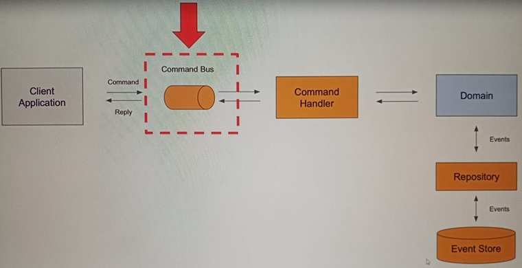
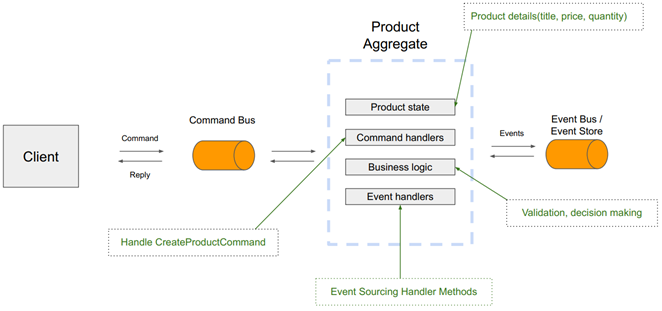

# Sección 07: Patrón CQRS en product-service

---

## Acepta Body HTTP Request

Vamos a crear una clase que nos permitirá mapear los valores enviados en el body de la petición.

````java

@Data
public class CreateProductRestModel {
    private String title;
    private BigDecimal price;
    private Integer quantity;
}
````

Ahora en el `ProductController` modificamos el endpoint `createProduct()` para mapear los valores enviados en el cuerpo
de la solicitud a una clase java.

````java

@RequiredArgsConstructor
@RestController
@RequestMapping(path = "/api/v1/products")
public class ProductController {

    private final Environment environment;

    /* otro endpoint */

    @PostMapping
    public String createProduct(@RequestBody CreateProductRestModel request) {
        return "HTTP POST Handled " + request.getTitle();
    }

    /* otros endpoints */
}
````

Para probar si los valores que estamos enviando se están mapeando a la clase java, vamos a realizar una petición
levantando los servicios en este orden:

1. Discover Server
2. Product Service
3. Gateway Server

Finalmente, realizamos la petición y vemos que todo está funcionando correctamente.

````bash
$ curl -v -X POST -H "Content-Type: application/json" -d "{\"title\": \"Samsung 20\", \"price\": 3500.50, \"quantity\": 10}" http://localhost:8080/api/v1/products
>
* upload completely sent off: 57 bytes
< HTTP/1.1 200 OK
< Content-Type: text/plain;charset=UTF-8
< Content-Length: 28
< Date: Tue, 07 Jan 2025 21:13:13 GMT
<
HTTP POST Handled Samsung 20
````

## Agrega dependencia de Axon Framework al Product Service

Antes de continuar debemos agregar a nuestro `product-service` la dependencia de `Axon Framework`.

````xml
<!-- https://mvnrepository.com/artifact/org.axonframework/axon-spring-boot-starter -->
<dependency>
    <groupId>org.axonframework</groupId>
    <artifactId>axon-spring-boot-starter</artifactId>
    <version>4.10.3</version>
</dependency>
````

#### Nota: Actualización de Axon Framework a la versión 4.7.0 (En mi caso es la 4.10)

> Desde que publicó este curso en video, `Axon Framework` se ha actualizado a una versión más reciente. Lamentablemente,
> hay algunos cambios importantes.
>
> Abra el siguiente enlace en una nueva ventana del
> navegador: [Actualización a la versión 4.7](https://docs.axoniq.io/axon-framework-reference/4.10/upgrading-to-4-7/).
> Manténgalo abierto mientras crea las primeras clases de su aplicación. Esta página contiene información sobre todos
> los cambios importantes y cómo resolverlos.

## Crea una nueva clase de comando

Cuando se nombran comandos en `CQRS`, hay una convención de nomenclatura:

````
<Verb><Noun>Command
````

En nuestro caso crearemos la clase de comando llamada `CreateProductCommand`. Esta clase la crearemos en el paquete
`command`, dado que estamos siguiendo el patrón de diseño `CQRS` donde debemos mostrar una clara separación entre
la API de comandos y la API de consultas.

````java
package dev.magadiflo.app.command;

import lombok.Builder;
import lombok.Data;
import org.axonframework.modelling.command.TargetAggregateIdentifier;

import java.math.BigDecimal;

@Data
@Builder
public class CreateProductCommand {
    @TargetAggregateIdentifier
    private final String productId;
    private final String title;
    private final BigDecimal price;
    private final Integer quantity;
}
````

Notar que a todos los atributos de la clase anterior las hemos definido como `final` con la finalidad de hacer esta
clase como una clase de solo lectura.

Además, hemos agregado un atributo llamado `productId` a quien lo anotamos con `@TargetAggregateIdentifier`.
`Axon Framework` utilizará este identificador para asociar este comando con un objeto agregado. Un Agregado será nuestro
objeto de dominio y manejará comandos, validará el comando y decidirá si el nuevo producto puede ser creado o si el
evento necesita ser borrado.

Función de `@TargetAggregateIdentifier`:

- `Identificación del agregado objetivo`: Axon Framework utiliza esta anotación para determinar a qué agregado debe
  enviarse un comando. En términos simples, indica que el valor de este campo (`productId` en tu caso) se utilizará para
  identificar el agregado que manejará el comando.


- `Asociación con el agregado`: Cuando se maneja un comando, el marco necesita saber cuál instancia de un agregado
  específico debe procesarlo. El valor del campo marcado con esta anotación le proporciona al Axon Framework la clave
  para buscar el agregado correspondiente.

Contexto en tu clase `CreateProductCommand`:

- La clase define un comando (`CreateProductCommand`) que probablemente se envíe para crear un producto.
- El `productId`, marcado con `@TargetAggregateIdentifier`, asegura que `Axon Framework` sepa a cuál agregado de
  producto (`ProductAggregate`, por ejemplo) está destinado este comando.
- Esto es crucial en sistemas `CQRS` y `Event Sourcing`, donde los comandos se enrutan a agregados específicos para
  ejecutar acciones que alteran su estado.

## Crea un nuevo objeto de CreateProductCommand

Como ya tenemos creado nuestra clase `CreateProductCommand`, por ahora continuaremos creando un objeto de esta clase
almacenando los valores obtenidos del request.

````java

@RequiredArgsConstructor
@RestController
@RequestMapping(path = "/api/v1/products")
public class ProductController {

    private final Environment environment;

    /* other endpoint */

    @PostMapping
    public String createProduct(@RequestBody CreateProductRestModel request) {
        CreateProductCommand createProductCommand = CreateProductCommand.builder()
                .price(request.getPrice())
                .quantity(request.getQuantity())
                .title(request.getTitle())
                .productId(UUID.randomUUID().toString())
                .build();
        return "HTTP POST Handled " + request.getTitle();
    }

    /* other endpoints */
}
````

## Envía comando a un Gateway de comandos

Un `Command Gateway` es un objeto que será usado para enviar este objeto de comando que tenemos creado a un
`Command Bus`. Pensemos en un `Command Gateway` como una api para enviar comandos y el `Command Bus` es un mecanismo
que recibe este comando y luego activa este comando en un controlador de comandos. Nosotros aún no tenemos ningún
controlador de comandos, pero crearemos uno más adelante.

En este momento necesitamos un `Command Gateway` para enviar el objeto `CreateProductCommand` a un `Command Bus`.

En el siguiente diagrama se muestra el `Command Bus` para ayudarnos a visualizar mejor el panorama en la
arquitectura de `Axon`.

El `Command Bus` es un mecanismo que envía comandos a sus respectivos controladores de comandos. Cada comando siempre
es enviado exactamente a un controlador de comandos y si no hay un controlador de comandos disponible para un
`dispatch command`, una excepción será lanzada.



A continuación se muestra nuestra clase controladora `ProductController` donde estamos inyectando el `CommandGateway`
importado de `org.axonframework.commandhandling.gateway.CommandGateway`.

````java

@RequiredArgsConstructor
@RestController
@RequestMapping(path = "/api/v1/products")
public class ProductController {

    private final Environment environment;
    private final CommandGateway commandGateway;

    /* another endpoint */

    @PostMapping
    public String createProduct(@RequestBody CreateProductRestModel request) {
        CreateProductCommand createProductCommand = CreateProductCommand.builder()
                .price(request.getPrice())
                .quantity(request.getQuantity())
                .title(request.getTitle())
                .productId(UUID.randomUUID().toString())
                .build();

        String returnValue;
        try {
            returnValue = this.commandGateway.sendAndWait(createProductCommand);
        } catch (Exception e) {
            returnValue = e.getLocalizedMessage();
        }
        return returnValue;
    }

    /* other endpoints */
}
````

El uso del `CommandGateway` y específicamente del método `sendAndWait` en `Axon Framework` tiene como objetivo
simplificar el envío de comandos dentro de tu aplicación.

#### ¿Qué es el CommandGateway?

- Es una interfaz proporcionada por `Axon Framework` para enviar comandos a los agregados de manera sencilla.
- Abstrae los detalles de cómo se envían los comandos y cómo se manejan sus respuestas.

#### ¿Qué hace el método sendAndWait?

- `Envío del comando`: Envía el comando al `Bus de Comandos de Axon`.
- `Espera una respuesta`: Pausa la ejecución del código hasta que el comando sea procesado y devuelva una respuesta o
  lance una excepción.
    - Si el comando se procesa correctamente, devuelve un valor (puede ser un ID o un mensaje).
    - Si ocurre algún problema (como una validación fallida), lanza una excepción.

En nuestro caso, estás enviando el comando `CreateProductCommand`, que probablemente será manejado por un agregado como
`ProductAggregate`.

## ProductAggregate - Introducción

La clase agregada es el núcleo de nuestro microservicio, es su objeto de dominio, contiene el estado actual del objeto
principal.

En este apartado estamos trabajando con el `product-service`, eso significa que nuestra clase agregada se llamará
`ProductAggregate`. Este objeto `ProductAggregate` contendrá el estado actual del objeto producto. Así que mantendrá
el valor actual del título del producto, mantendrá el valor actual del precio del producto y el valor actual de la
cantidad del producto.

Adicionalmente, al estado actual, el `ProductAggregate` contendrá métodos que puedan manejar comandos. Por ejemplo,
cuando se envíe un comando para crear producto, será un método de la clase agregada el que lo maneje.

El `ProductAggregate` también tendrá una lógica de negocio, por ejemplo cuando gestione la orden de crear un producto
será necesario validar esta orden y decidir si se puede crear o no.

El `ProductAggregate` contendrá métodos de control de origen de eventos y cada vez que cambie un estado de la
información del producto, se invocará un método de origen de eventos. Además, cuando se recibe un comando para
actualizar los detalles del producto, por ejemplo, el estado de este objeto agregado del producto, primero tendrá que
ser cargado desde el almacén de eventos.

Así que lo que sucederá es esto, `Axon Framework` creará primero un nuevo objeto vacío de la clase `ProductAggregate`,
y es por eso que necesita un constructor vacío. A continuación, leerá cada uno de los eventos almacenados en el almacén
de eventos para este agregado y aplicará ese evento al agregado.



## Crea la clase ProductAggregate

Esta clase es un agregado en el contexto del patrón `CQRS` y `Event Sourcing`. Un agregado en `Axon Framework`
representa un componente central que maneja comandos y encapsula las reglas de negocio. Aquí está estructurada para
manejar un comando llamado `CreateProductCommand`.

````java
package dev.magadiflo.app.command;

import lombok.NoArgsConstructor;
import org.axonframework.commandhandling.CommandHandler;
import org.axonframework.spring.stereotype.Aggregate;

@NoArgsConstructor
@Aggregate
public class ProductAggregate {

    @CommandHandler
    public ProductAggregate(CreateProductCommand createProductCommand) {
        // validate create product command
    }

}
````

1. `@Aggregate`
    - `Propósito`: Marca esta clase como un agregado raíz en Axon Framework. Declara que esta clase es un agregado
      manejado por Axon.
    - `Función`:
        - Permite que Axon reconozca esta clase como un componente responsable de manejar comandos relacionados con una
          entidad lógica.
        - Internamente, Axon asegura que el estado del agregado esté gestionado adecuadamente (ya sea cargándolo desde
          la base de datos o reconstruyéndolo a partir de eventos, dependiendo de tu configuración).

2. `@CommandHandler`
    - `Propósito`: Marca un método o constructor para manejar un comando específico.
    - `Función`:
        - Este constructor se ejecuta cuando se recibe un comando del tipo `CreateProductCommand`.
        - Es aquí donde se valida el comando y se ejecuta la lógica necesaria para inicializar el estado del agregado.

3. `@NoArgsConstructor`, genera un constructor sin argumentos utilizando Lombok. `Axon Framework` requiere un
   constructor sin argumentos en los agregados para reconstruir su estado a partir de eventos (en el caso de
   `Event Sourcing`).

### Flujo del Constructor con @CommandHandler

1. Cuando un comando `CreateProductCommand` se envía al agregado a través del `CommandGateway`, `Axon` busca un
   manejador para este comando en la clase marcada con `@Aggregate`.
2. Encuentra el constructor marcado con `@CommandHandler`.
3. Ejecuta el constructor, donde puedes realizar:
    - Validaciones del comando.
    - Lógica de negocio inicial (como inicializar el estado del agregado).
    - Generar eventos si es necesario.

## Valida el CreateProductCommand

Validamos el `CreateProductCommand` que pasamos por parámetro al constructor del `ProductAggregate`. Realizar
validaciones en el comando dentro del constructor es una buena práctica. Por ejemplo:

- Verificar que el precio sea mayor que cero.
- Verificar que la cantidad no sea nulo y sea mayor o igual a cero.
- Asegurar que el título no esté vacío o nulo.

Esto garantiza que los datos iniciales del agregado sean válidos y cumplan las reglas de negocio.

````java

@NoArgsConstructor
@Aggregate
public class ProductAggregate {

    @CommandHandler
    public ProductAggregate(CreateProductCommand createProductCommand) {
        if (createProductCommand.getPrice().compareTo(BigDecimal.ZERO) <= 0) {
            throw new IllegalArgumentException("El precio no puede ser menor o igual a cero");
        }

        if (Objects.isNull(createProductCommand.getQuantity()) || createProductCommand.getQuantity() < 0) {
            throw new IllegalArgumentException("La cantidad debe ser mayor o igual a cero");
        }

        if (Objects.isNull(createProductCommand.getTitle()) || createProductCommand.getTitle().isBlank()) {
            throw new IllegalArgumentException("El título no puede estar vacío");
        }
    }

}
````

## Crea el ProductCreatedEvent

Cuando el comando pasa las validaciones (se procesa con éxito), a continuación, necesitamos lanzar un evento. Y para
lanzar un evento necesitaremos crear primero una clase de evento.

El nombre de la clase de evento deberá seguir esta convención de nomenclatura. Los nombres de los eventos deben estar
en pasado simple. Iniciar con el sustantivo, luego seguirá la acción realizada para finalizar con el término Event.

````
<Noun><PerformedAction>Event
````

Por ejemplo:

- Cuando el `CreateProductCommand` tiene éxito, nuestro `ProductAggregate` creará y publicará un
  `ProductCreatedEvent` (Evento de producto creado).
- Si el producto ha sido enviado, entonces publicaremos un evento llamado `ProductShippedEvent`
  (Evento de producto enviado).
- Si eliminamos el producto completamente, entonces publicaremos un evento llamado `ProductDeletedEvent`
  (Evento de producto eliminado).

### ¿Qué información llevará este objeto de evento?

Dependerá de nosotros y de las necesidades de nuestra aplicación.

### ¿Qué hay que hacer cuando se consume este objeto de evento?

En nuestro caso, queremos conservar la información de los productos recién creados en una base de datos. Luego, podemos
consultar esa tabla de la base de datos y devolver los detalles del producto a una aplicación cliente.

Así que, para persistir la información del producto en la base de datos, vamos a necesitar este objeto de evento para
contener todos los detalles del producto, que es: `productId`, `title`, `price` y `quantity`. Básicamente, la misma
información que ya está en una clase de comando.

````java

@Data
public class ProductCreatedEvent {
    private String productId;
    private String title;
    private BigDecimal price;
    private Integer quantity;
}
````

## Aplicando y publicando el ProductCreatedEvent

En este apartado vamos a publicar el `ProductCreatedEvent`. Así que vamos a crear una nueva instancia del
`ProductCreatedEvent`.

````java

@NoArgsConstructor
@Aggregate
public class ProductAggregate {

    @CommandHandler
    public ProductAggregate(CreateProductCommand createProductCommand) {
        if (createProductCommand.getPrice().compareTo(BigDecimal.ZERO) <= 0) {
            throw new IllegalArgumentException("El precio no puede ser menor o igual a cero");
        }

        if (Objects.isNull(createProductCommand.getQuantity()) || createProductCommand.getQuantity() < 0) {
            throw new IllegalArgumentException("La cantidad debe ser mayor o igual a cero");
        }

        if (Objects.isNull(createProductCommand.getTitle()) || createProductCommand.getTitle().isBlank()) {
            throw new IllegalArgumentException("El título no puede estar vacío");
        }

        ProductCreatedEvent productCreatedEvent = new ProductCreatedEvent();
        productCreatedEvent.setProductId(createProductCommand.getProductId());
        productCreatedEvent.setTitle(createProductCommand.getTitle());
        productCreatedEvent.setPrice(createProductCommand.getPrice());
        productCreatedEvent.setQuantity(createProductCommand.getQuantity());

        AggregateLifecycle.apply(productCreatedEvent);
    }

}
````

El método `AggregateLifecycle.apply` que hemos agregado al constructor de tu clase `ProductAggregate` cumple un papel
esencial en el diseño basado en `event sourcing` en `Axon Framework`. Aquí te explico en detalle qué hace y por qué es
importante:

1. `Emitir un evento`
    - `AggregateLifecycle.apply`, emite un evento (en este caso, un `ProductCreatedEvent`) para notificar que algo ha
      sucedido en el agregado como resultado de un comando.
    - Este evento se registra en el `Bus de Eventos` de `Axon` y puede ser procesado por otros componentes de la
      aplicación, como manejadores de eventos o proyecciones.


2. `Persistir el evento`
    - En un sistema que usa `Event Sourcing`, `Axon` persiste este evento en un almacén de eventos `(Event Store)`, que
      actúa como la fuente única de verdad para reconstruir el estado del agregado en el futuro.
    - Si no estás usando `Event Sourcing`, el evento solo se distribuye, pero no se persiste.


3. `Desencadenar manejadores de eventos internos`
    - Después de emitir el evento, `Axon` busca métodos anotados con `@EventSourcingHandler` dentro del mismo agregado
      y los invoca para actualizar su estado interno.
    - Aunque aún no has agregado este manejador, es una práctica esencial para que el agregado mantenga un estado
      coherente.

### Resumen

La llamada a `AggregateLifecycle.apply`:

- Emite un evento que representa un cambio de estado en el agregado.
- Persiste el evento en el `Event Store` (si usas `Event Sourcing`).
- Desencadena manejadores internos anotados con `@EventSourcingHandler` para actualizar el estado del agregado.
- Es fundamental para mantener la consistencia entre el estado del agregado y los eventos emitidos.

## @EventSourcingHandler

### Sobre el @AggregateIdentifier

- `@AggregateIdentifier`, marca el campo que actúa como identificador único del agregado. En tu caso, el campo
  `productId` es el identificador único para el agregado `ProductAggregate`.
- `Axon Framework` utiliza este identificador para enrutar correctamente los comandos a la instancia correspondiente
  del agregado.
- Cuando envías un comando a través del `CommandGateway`, `Axon` busca automáticamente el agregado correspondiente en
  base a este identificador. Por ejemplo, en nuestro caso eso se realiza en el `ProductController`, en el método
  `createProduct()`, donde se usa el código `this.commandGateway.sendAndWait(createProductCommand);`, este objeto
  `createProductCommand` tiene definido el `.productId(UUID.randomUUID().toString())`. Aquí, `Axon` utiliza `productId`
  para encontrar el agregado `ProductAggregate` correspondiente en su repositorio.

### Sobre método on() anotado con @EventSourcingHandler

- Este método es invocado por `Axon Framework` cada vez que un evento del tipo `ProductCreatedEvent` es aplicado al
  agregado.
- Se utiliza para actualizar el estado del agregado basado en el evento recibido.
- En un sistema de `event sourcing`, el estado del agregado no se almacena directamente en la base de datos. En su
  lugar:
    1. Se persisten los eventos emitidos (como `ProductCreatedEvent`).
    2. Cuando se necesita reconstruir el agregado (por ejemplo, después de un reinicio del sistema), `Axon` reproduce
       todos los eventos históricos relacionados con ese agregado.
    3. El método `on` se invoca para aplicar cada evento al estado del agregado.


- Cuando se recibe un `ProductCreatedEvent`, este método asigna los valores del evento (`productId`, `title`, `price`,
  `quantity`) a los atributos del agregado.
- Esto asegura que el agregado tenga un estado coherente y actualizado.

````java

@NoArgsConstructor
@Aggregate
public class ProductAggregate {

    @AggregateIdentifier
    private String productId;
    private String title;
    private BigDecimal price;
    private Integer quantity;

    @CommandHandler
    public ProductAggregate(CreateProductCommand createProductCommand) {
        /* code */
    }

    @EventSourcingHandler
    public void on(ProductCreatedEvent event) {
        this.productId = event.getProductId();
        this.title = event.getTitle();
        this.price = event.getPrice();
        this.quantity = event.getQuantity();
    }

}
````

### Resumen

- `@AggregateIdentifier` establece el identificador único del agregado para enrutar comandos correctamente.
- El método `on` anotado con `@EventSourcingHandler` aplica eventos al estado del agregado, permitiendo su
  reconstrucción basada en `Event Sourcing`.
- Todo este diseño refuerza la consistencia y el historial completo de los cambios en el sistema.

## Agrega dependencia de Google Guava

Vamos a agregar la dependencia de `Google Guava` al `pom.xml` de nuestro microservicio. Esto, porque cuando se utiliza
`Axon` con algún proyecto de `Spring Cloud`, la dependencia principal empieza a pedir que se añada `Google Guava` y la
razón de esto podría ser que algunas dependencias transitivas utilizan `Google Guava` y podría haber algún conflicto de
versiones, por lo que `Google Guava` se convierte en obligatoria.

````xml
<!-- https://mvnrepository.com/artifact/com.google.guava/guava -->
<dependency>
    <groupId>com.google.guava</groupId>
    <artifactId>guava</artifactId>
    <version>33.4.0-jre</version>
</dependency>
````
