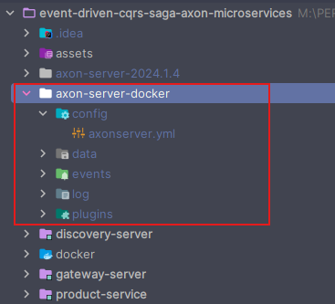
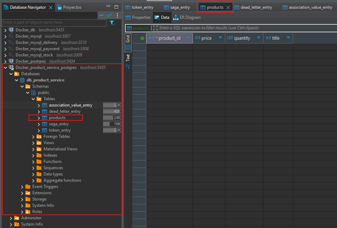
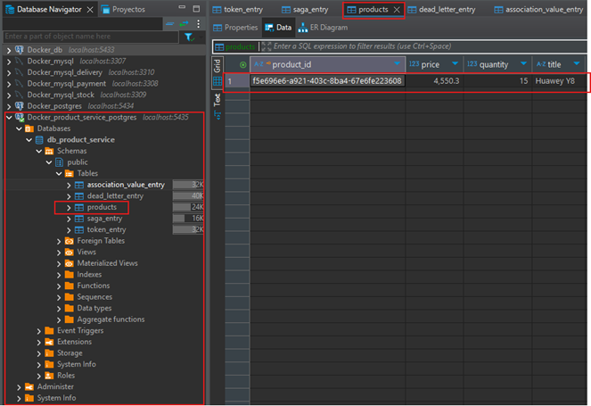

# Sección 08: Persiste evento en la base de datos de productos

---

## Agrega dependencia de Spring Data JPA y PostgreSQL

Agregaremos las siguientes dos dependencias al `pom.xml` del `product-service`.

````xml

<dependencies>
    <dependency>
        <groupId>org.springframework.boot</groupId>
        <artifactId>spring-boot-starter-data-jpa</artifactId>
    </dependency>

    <dependency>
        <groupId>org.postgresql</groupId>
        <artifactId>postgresql</artifactId>
        <scope>runtime</scope>
    </dependency>
</dependencies>
````

## Configura acceso a base de datos en el application.yml

En el `application.yml` del `product-service` agregamos las siguientes configuraciones hacia nuestra base de datos.

````yml
spring:
  datasource:
    url: jdbc:postgresql://localhost:5435/db_product_service
    username: magadiflo
    password: magadiflo
  jpa:
    hibernate:
      ddl-auto: update
    properties:
      hibernate:
        format_sql: true

logging:
  level:
    dev.magadiflo.app: DEBUG
    org.hibernate.SQL: DEBUG
````

En la raíz del proyecto general vamos a crear un directorio llamado `/docker` y dentro de él crearemos un archivo
llamado `compose.yml` donde agregaremos la configuración para generar un contenedor de la base de datos para nuestro
`product-service`.

````yml
services:
  postgres:
    image: postgres:15.2-alpine
    container_name: c-product-service-postgres
    restart: unless-stopped
    environment:
      POSTGRES_DB: db_product_service
      POSTGRES_USER: magadiflo
      POSTGRES_PASSWORD: magadiflo
    ports:
      - "5435:5432"
    volumes:
      - postgres_axon_product_data:/var/lib/postgresql/data
    networks:
      - axon_network

volumes:
  postgres_axon_product_data:
    name: postgres_axon_product_data

networks:
  axon_network:
    name: axon_network
````

A continuación, nos posicionamos dentro del directorio `/docker` y ejecutamos el archivo `compose.yml` con el siguiente
comando.

````bash
M:\PERSONAL\PROGRAMACION\DESARROLLO_JAVA_SPRING\01.udemy\05.sergey_kargopolov\event-driven-cqrs-saga-axon-microservices\docker (main -> origin)
$ docker compose up -d                                                                                                                         
[+] Running 3/3                                                                                                                                
 ✔ Network axon_network                  Created                                                                                               
 ✔ Volume "postgres_axon_product_data"   Created                                                                                               
 ✔ Container c-product-service-postgres  Started                                                                                                                                                                                             
````

Si ahora listamos los contenedores, veremos que nuestro contenedor `c-product-service-postgres` se ha creado
correctamente y está levantado (`Up`).

````bash
$ docker container ls -a
CONTAINER ID   IMAGE                                       COMMAND                  CREATED          STATUS                      PORTS                    NAMES
226986e7344b   postgres:15.2-alpine                        "docker-entrypoint.s…"   34 seconds ago   Up 33 seconds               0.0.0.0:5435->5432/tcp   c-product-service-postgres
````

Si listamos el volumen del contenedor, vemos que se ha creado sin problemas.

````bash
$ docker volume ls
DRIVER    VOLUME NAME
local     postgres_axon_product_data
````

Incluso, vemos que se ha creado correctamente el network definido en el archivo `compose.yml`.

````bash
$ docker network ls
NETWORK ID     NAME             DRIVER    SCOPE
c86450db1e87   axon_network     bridge    local
````

Si ahora utilizamos `DBeaver`, nos podemos conectar fácilmente a la base de dato que acabamos de levantar usando un
contenedor de `Docker`.


También podríamos entrar a la base de datos a través del contenedor mismo. Utilizando el siguiente comando ingresamos
dentro del contenedor, colocamos el usuario y nombre de la base de datos y listamos las tablas existentes. Como aún
no tenemos ninguna tabla nos mostrará el mensaje `Did not find any relations`.

````bash
$ docker container exec -it c-product-service-postgres /bin/sh
/ # psql -U magadiflo -d db_product_service
psql (15.2)
Type "help" for help.

db_product_service=# \dt
Did not find any relations.
````

## Crea el ProductEntity

En el `product-service` creamos la siguiente entidad `ProductEntity` que será mapeado a la tabla `products` de la
base de datos.

````java

@AllArgsConstructor
@NoArgsConstructor
@Builder
@Data
@Entity
@Table(name = "products")
public class ProductEntity {
    @Id
    private String productId;

    @Column(unique = true)
    private String title;

    private BigDecimal price;

    private Integer quantity;
}
````

## Crea ProductRepository

En este apartado crearemos el repositorio para nuestro `ProductEntity`, donde definiremos dos métodos personalizados
utilizando los `Query Methods` de `Spring Data JPA`. Estos métodos permiten generar consultas automáticamente basándose
en los nombres de los métodos, siguiendo una convención predefinida.

`Spring Data JPA` analiza el nombre del método y lo traduce en una consulta `JPQL (Java Persistence Query Language)` o
`SQL`, dependiendo del repositorio configurado. Este mecanismo se basa en el parsing de los nombres de los métodos.

````java
public interface ProductRepository extends JpaRepository<ProductEntity, String> {
    Optional<ProductEntity> findByProductId(String productId);

    Optional<ProductEntity> findByProductIdOrTitle(String productId, String title);
}
````

En nuestro caso:

1. `findByProductId(String productId)`
    - El prefijo `findBy` indica que es una consulta de búsqueda.
    - `ProductId` especifica el campo de la entidad `ProductEntity` que se utiliza como criterio de búsqueda.

2. `findByProductIdOrTitle(String productId, String title)`
    - El operador `Or` permite buscar registros que coincidan con cualquiera de las dos condiciones: `productId` o
      `title`.

## Crea Handler/Projection de eventos de productos

En este apartado crearemos una clase manejadora de eventos. Un método en esta clase manejará un evento publicado por
nuestro objeto `ProductAggregate` y persistirá la información sobre el producto creado en la tabla `products` de la
base de datos.

A menudo, este tipo de clases se les llama `projection`, por ejemplo, podríamos llamar a esta clase `ProductProjection`
en lugar de `ProductEventsHandler`. Podemos elegir el nombre que queramos, en nuestro caso utilizaremos
`ProductEventsHandler`.

````java

@Component
public class ProductEventsHandler {

    @EventHandler
    public void on(ProductCreatedEvent event) {

    }
}
````

Esta clase es un `event handler` o manejador de eventos, lo que significa que está diseñada para escuchar y reaccionar
a eventos que ocurren en tu sistema. En este caso, el evento que está escuchando es un `ProductCreatedEvent`.

La anotación `@EventHandler` marca un método que será invocado cuando se dispare un evento específico en el sistema de
`Axon Framework`. En este caso, el método `on(ProductCreatedEvent event)` será llamado cada vez que un
`ProductCreatedEvent` sea publicado.

- `¿Cómo funciona?`, cuando el método `AggregateLifecycle.apply(productCreatedEvent)` en tu agregado `ProductAggregate`
  se ejecuta, `Axon` publica este evento (`ProductCreatedEvent`) en su bus de eventos. Todos los métodos anotados con
  `@EventHandler` y que manejan este tipo de evento serán ejecutados automáticamente.

- `Parámetro del método`, el evento `ProductCreatedEvent` que llega como parámetro contiene los datos relevantes (como
  `productId`, `title`, `price`, `quantity`). Puedes usar esta información para realizar acciones adicionales, como
  persistir datos en la base de datos.

## Implementando el método anotado con @EventHandler

En este apartado implementamos el método `on`, que actúa como manejador del evento `ProductCreatedEvent`. Dentro de
este método, creamos un objeto `ProductEntity` utilizando la información contenida en el evento. Luego, usamos la
interfaz `ProductRepository` para guardar este objeto como un nuevo registro en la tabla `products` de la base
de datos, garantizando que los datos emitidos por el evento sean persistidos correctamente.

En general, el flujo sería así:

1. En el agregado `ProductAggregate`, cuando se dispara el evento `ProductCreatedEvent` (con
   `AggregateLifecycle.apply`), `Axon Framework` publica el evento en el bus de eventos.
2. `Axon` detecta todas las clases con métodos anotados con `@EventHandler` que manejan ese tipo de evento. En este
   caso, el método `on(ProductCreatedEvent event)` es identificado como un manejador.
3. `Axon` invoca este método automáticamente, pasando los datos del evento.
4. El método usa esos datos para construir un objeto de la entidad `ProductEntity` y lo guarda en la base de datos a
   través del repositorio.

````java

@RequiredArgsConstructor
@Component
public class ProductEventsHandler {

    private final ProductRepository productRepository;

    @EventHandler
    public void on(ProductCreatedEvent event) {

        ProductEntity productEntity = ProductEntity.builder()
                .productId(event.getProductId())
                .title(event.getTitle())
                .price(event.getPrice())
                .quantity(event.getQuantity())
                .build();

        this.productRepository.save(productEntity);
    }
}
````

## Ejecutando aplicación

En este apartado vamos a ejecutar nuestra aplicación `product-service` y ver si el producto que hemos creado se
persiste con éxito en la tabla `products` de la base de datos.

Ejecutaremos los servidores y servicios en el siguiente orden:

### 1. Contenedor de Postgres

Para empezar limpios, vamos a bajar el servicio del contenedor de la base de datos de postgres que creamos con docker
compose y lo vamos a volver a levantar.

````bash
M:\PERSONAL\PROGRAMACION\DESARROLLO_JAVA_SPRING\01.udemy\05.sergey_kargopolov\event-driven-cqrs-saga-axon-microservices\docker (main -> origin)
$ docker compose down -v                                                                                                                       
[+] Running 3/3                                                                                                                                
 ✔ Container c-product-service-postgres  Removed                                                                                               
 ✔ Volume postgres_axon_product_data     Removed                                                                                               
 ✔ Network axon_network                  Removed                                                                                               
````

Ahora volvemos a levantar el contenedor de postgres

````bash
M:\PERSONAL\PROGRAMACION\DESARROLLO_JAVA_SPRING\01.udemy\05.sergey_kargopolov\event-driven-cqrs-saga-axon-microservices\docker (main -> origin)
$ docker compose up -d                                                                                                                         
[+] Running 3/3                                                                                                                                
 ✔ Network axon_network                  Created                                                                                               
 ✔ Volume "postgres_axon_product_data"   Created                                                                                               
 ✔ Container c-product-service-postgres  Started                                                                                               
````

Si listamos los contenedores, veremos que el contenedor de postgres está ejecutándose correctamente.

````bash
$ docker container ls -a
CONTAINER ID   IMAGE                             COMMAND                  CREATED              STATUS                      PORTS                    NAMES
c6b2dc70ef20   postgres:15.2-alpine              "docker-entrypoint.s…"   About a minute ago   Up About a minute           0.0.0.0:5435->5432/tcp   c-product-service-postgres
````

### 2. Axon Server

Lo mismo vamos a hacer con el contenedor de `Axon Server`, lo vamos a detener y luego a eliminar.

````bash
$ docker container stop c-axon-server
c-axon-server

$ docker container rm c-axon-server
c-axon-server
````

A continuación, en el directorio donde realizamos los bind mounts `/axon-server-docker` ubicado en la raíz principal
de este proyecto `event-driven-cqrs-saga-axon-microservices` vamos a dejar únicamente el directorio `/config` que
contiene el archivo `axonserver.yml` y cuyo contenido es el siguiente:

````yml
server:
  port: 8024

axoniq:
  axonserver:
    name: MyAxonServer
    hostname: localhost
    devmode:
      enabled: true
    standalone: true
````

Los demás directorios los eliminaremos, tales como el `/data`, `/events`, `/logs`, etc.

Luego, nos posicionamos, mediante la línea de comando, en el directorio donde realizamos los bind mounts
`/axon-server-docker`, para ejecutar el siguiente comando que creará el servidor de axon.

````bash
M:\PERSONAL\PROGRAMACION\DESARROLLO_JAVA_SPRING\01.udemy\05.sergey_kargopolov\event-driven-cqrs-saga-axon-microservices\axon-server-docker (main -> origin)

$ docker container run -d -p 8024:8024 -p 8124:8124 --name c-axon-server -v .\data:/axonserver/data -v .\events:/axonserver/events -v .\log:/axonserver/log -v .\config:/axonserver/config -v .\plugins:/axonserver/plugins axoniq/axonserver:2024.1.4-jdk-17-nonroot
cf330e2c858ab370e05a0944745093c19b12465fc73959b16019e63a89eec63b
````

Si ahora revisamos el directorio `/axon-server-docker` vemos que nuevamente se han creado los directorios que eliminamos
anteriormente.



> Recordar que estoy volviendo a crear los contenedores para empezar de cero, dado que en las secciones anteriores ya
> hemos venido ejecutando y al momento de llegar a este punto me salía un error de constraint, dado que he registrado
> varias veces un mismo producto, por eso para iniciar sin problemas es que estoy volviendo a crear los contenedores
> desde cero para tenerlos limpios.

Si hasta este punto listamos los contenedores, veremos que tanto el de la base de datos como el de Axon server se están
ejecutando sin problemas.

````bash
$ docker container ls -a
CONTAINER ID   IMAGE                                       COMMAND                  CREATED          STATUS                      PORTS                                                      NAMES
cf330e2c858a   axoniq/axonserver:2024.1.4-jdk-17-nonroot   "java -jar ./axonser…"   8 minutes ago    Up 8 minutes                0.0.0.0:8024->8024/tcp, 0.0.0.0:8124->8124/tcp, 8224/tcp   c-axon-server
c6b2dc70ef20   postgres:15.2-alpine                        "docker-entrypoint.s…"   20 minutes ago   Up 20 minutes               0.0.0.0:5435->5432/tcp                                     c-product-service-postgres
````

### 3. Discovery Server

Como tercer paso, levantamos el `discovery-server`.

### 4. Product Service

Como cuarto paso, ejecutamos el `product-service` y si revisamos la base de datos, veremos que se han creado varias
tablas, incluyendo la tabla `products` que se mapea a nuestra entidad `ProductEntity`.



### 5. Gateway Server

Como quinto paso, levantamos el `gateway-server` para tener un único punto por donde realizaremos las peticiones.

### 6. Realiza petición al endpoint del product-service

Al realizar le petición observamos que nos retorna el id generado `f5e696e6-a921-403c-8ba4-67e6fe223608` y en la consola
no se muestra algún error, por lo que podríamos decir que el registro fue exitoso.

````bash
$ curl -v -X POST -H "Content-Type: application/json" -d "{\"title\": \"Huawey Y8\", \"price\": 4550.30, \"quantity\": 15}" http://localhost:8080/api/v1/products
>
< HTTP/1.1 200 OK
< Content-Type: text/plain;charset=UTF-8
< Content-Length: 36
< Date: Thu, 23 Jan 2025 21:38:19 GMT
<
f5e696e6-a921-403c-8ba4-67e6fe223608
````

Para verificar que el producto fue registrado sin problemas en la base de datos, vamos a la tabla `products` y
observemos que allí está el producto.



### Nota

Como hemos visto, nuestra aplicación `product-service` ha registrado correctamente el producto enviado por el cliente
`curl` hacia la base de datos. Pero, me he dado cuenta que cada 1 segundo aproximadamente, en consola se está mostrando
el siguiente log.

````bash
2025-01-23T16:31:10.569-05:00 DEBUG 10828 --- [product-service] [lo.app.query]-0] org.hibernate.SQL                        : 
    update
        token_entry te1_0 
    set
        timestamp=? 
    where
        te1_0.processor_name=? 
        and te1_0.segment=? 
        and te1_0.owner=?
````

### ¿Ese comportamiento es normal?

Sí, ese comportamiento es completamente normal cuando usas `Axon Framework` con una base de datos como `PostgreSQL`. Lo
que estás viendo en los logs es el proceso de control de tokens que Axon utiliza para manejar los procesadores de
eventos distribuidos, como los tracking event processors.

### ¿Qué está pasando?

1. `Procesadores de eventos y control de tokens`:

- Axon Framework usa los token entries (almacenados en la tabla `token_entry` de la base de datos) para rastrear qué
  eventos han sido procesados por un procesador de eventos.
- Estos registros aseguran que los eventos se procesen una sola vez, incluso si tienes múltiples instancias de la
  aplicación ejecutándose en paralelo (algo común cuando usas Eureka o algún sistema de balanceo de carga).

2. `El proceso de actualización`:

- Cada procesador de eventos mantiene su progreso actualizando la tabla `token_entry`.
- Axon actualiza periódicamente este token, incluso si no hay nuevos eventos, como una especie de "latido" (heartbeat)
  para mostrar que el procesador está activo y escuchando.

3. `Frecuencia del log`:

- Por defecto, los tracking event processors verifican continuamente el estado de los eventos en la base de datos, lo
  que genera logs de este tipo si tienes el nivel de depuración (`DEBUG`) habilitado en `Hibernate`.

### ¿Cómo reducir la cantidad de logs?

- Si bien este comportamiento es esperado, puedes tomar las siguientes medidas para hacerlo menos molesto:
    - `Cambiar el nivel de logs de Hibernate`, en tu archivo `application.properties` o `application.yml`, cambia el
      nivel de logging de `Hibernate SQL` a `WARN` o desactívalo:

````properties
logging.level.org.hibernate.SQL=WARN
logging.level.org.hibernate.type.descriptor.sql=TRACE
````

En mi caso, lo dejaré tal cual como lo he configurado desde un inicio, como `DEBUG`, aunque anteriormente se muestra
la forma de cómo reducir la cantidad de logs.

````yml
logging:
  level:
    dev.magadiflo.app: DEBUG
    org.hibernate.SQL: DEBUG
````
