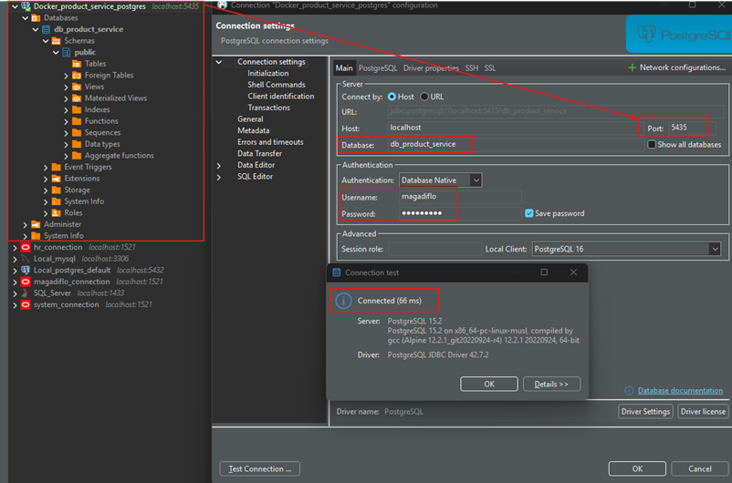

# Sección 08: Persiste evento en la base de datos de productos

---

## Agrega dependencia de Spring Data JPA y PostgreSQL

Agregaremos las siguientes dos dependencias al `pom.xml` del `product-service`.

````xml

<dependencies>
    <dependency>
        <groupId>org.springframework.boot</groupId>
        <artifactId>spring-boot-starter-data-jpa</artifactId>
    </dependency>

    <dependency>
        <groupId>org.postgresql</groupId>
        <artifactId>postgresql</artifactId>
        <scope>runtime</scope>
    </dependency>
</dependencies>
````

## Configura acceso a base de datos en el application.yml

En el `application.yml` del `product-service` agregamos las siguientes configuraciones hacia nuestra base de datos.

````yml
spring:
  datasource:
    url: jdbc:postgresql://localhost:5435/db_product_service
    username: magadiflo
    password: magadiflo
  jpa:
    hibernate:
      ddl-auto: update
    properties:
      hibernate:
        format_sql: true

logging:
  level:
    dev.magadiflo.app: DEBUG
    org.hibernate.SQL: DEBUG
````

En la raíz del proyecto general vamos a crear un directorio llamado `/docker` y dentro de él crearemos un archivo
llamado `compose.yml` donde agregaremos la configuración para generar un contenedor de la base de datos para nuestro
`product-service`.

````yml
services:
  postgres:
    image: postgres:15.2-alpine
    container_name: c-product-service-postgres
    restart: unless-stopped
    environment:
      POSTGRES_DB: db_product_service
      POSTGRES_USER: magadiflo
      POSTGRES_PASSWORD: magadiflo
    ports:
      - "5435:5432"
    volumes:
      - postgres_axon_product_data:/var/lib/postgresql/data
    networks:
      - axon_network

volumes:
  postgres_axon_product_data:
    name: postgres_axon_product_data

networks:
  axon_network:
    name: axon_network
````

A continuación, nos posicionamos dentro del directorio `/docker` y ejecutamos el archivo `compose.yml` con el siguiente
comando.

````bash
M:\PERSONAL\PROGRAMACION\DESARROLLO_JAVA_SPRING\01.udemy\05.sergey_kargopolov\event-driven-cqrs-saga-axon-microservices\docker (main -> origin)
$ docker compose up -d                                                                                                                         
[+] Running 3/3                                                                                                                                
 ✔ Network axon_network                  Created                                                                                               
 ✔ Volume "postgres_axon_product_data"   Created                                                                                               
 ✔ Container c-product-service-postgres  Started                                                                                                                                                                                             
````

Si ahora listamos los contenedores, veremos que nuestro contenedor `c-product-service-postgres` se ha creado
correctamente y está levantado (`Up`).

````bash
$ docker container ls -a
CONTAINER ID   IMAGE                                       COMMAND                  CREATED          STATUS                      PORTS                    NAMES
226986e7344b   postgres:15.2-alpine                        "docker-entrypoint.s…"   34 seconds ago   Up 33 seconds               0.0.0.0:5435->5432/tcp   c-product-service-postgres
````

Si listamos el volumen del contenedor, vemos que se ha creado sin problemas.

````bash
$ docker volume ls
DRIVER    VOLUME NAME
local     postgres_axon_product_data
````

Incluso, vemos que se ha creado correctamente el network definido en el archivo `compose.yml`.

````bash
$ docker network ls
NETWORK ID     NAME             DRIVER    SCOPE
c86450db1e87   axon_network     bridge    local
````

Si ahora utilizamos `DBeaver`, nos podemos conectar fácilmente a la base de dato que acabamos de levantar usando un
contenedor de `Docker`.



También podríamos entrar a la base de datos a través del contenedor mismo. Utilizando el siguiente comando ingresamos
dentro del contenedor, colocamos el usuario y nombre de la base de datos y listamos las tablas existentes. Como aún
no tenemos ninguna tabla nos mostrará el mensaje `Did not find any relations`.

````bash
$ docker container exec -it c-product-service-postgres /bin/sh
/ # psql -U magadiflo -d db_product_service
psql (15.2)
Type "help" for help.

db_product_service=# \dt
Did not find any relations.
````

## Crea el ProductEntity

En el `product-service` creamos la siguiente entidad `ProductEntity` que será mapeado a la tabla `products` de la
base de datos.

````java

@AllArgsConstructor
@NoArgsConstructor
@Builder
@Data
@Entity
@Table(name = "products")
public class ProductEntity {
    @Id
    private String productId;

    @Column(unique = true)
    private String title;

    private BigDecimal price;

    private Integer quantity;
}
````

## Crea ProductRepository

En este apartado crearemos el repositorio para nuestro `ProductEntity`, donde definiremos dos métodos personalizados
utilizando los `Query Methods` de `Spring Data JPA`. Estos métodos permiten generar consultas automáticamente basándose
en los nombres de los métodos, siguiendo una convención predefinida.

`Spring Data JPA` analiza el nombre del método y lo traduce en una consulta `JPQL (Java Persistence Query Language)` o
`SQL`, dependiendo del repositorio configurado. Este mecanismo se basa en el parsing de los nombres de los métodos.

````java
public interface ProductRepository extends JpaRepository<ProductEntity, String> {
    Optional<ProductEntity> findByProductId(String productId);

    Optional<ProductEntity> findByProductIdOrTitle(String productId, String title);
}
````

En nuestro caso:

1. `findByProductId(String productId)`
    - El prefijo `findBy` indica que es una consulta de búsqueda.
    - `ProductId` especifica el campo de la entidad `ProductEntity` que se utiliza como criterio de búsqueda.

2. `findByProductIdOrTitle(String productId, String title)`
    - El operador `Or` permite buscar registros que coincidan con cualquiera de las dos condiciones: `productId` o
      `title`.

