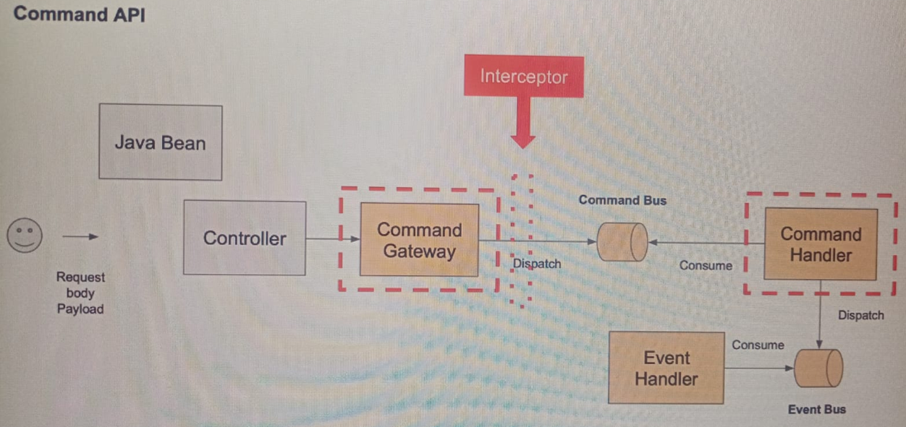

# Sección 11: Validación. Message Dispatch Interceptor

---

## Introducción al Message Dispatch Interceptor

Otra forma de validar un comando antes de que sea procesado y se publique un evento relevante, es utilizar el
`Message Dispatch Interceptor`.

El `message dispatch interceptor` se invoca cuando se envía una orden al bus de órdenes. Recordemos que en el
`ProductCommandController` hemos inyectado la interfaz `CommandGateway`. Este objeto enviará el comando al bus de
comandos y la clase manejadora de comandos `(Command Handler)` consumirá este mensaje del bus de comandos.

Así que podemos escribir un interceptor de envío de mensajes para interceptar el comando justo cuando se envía en un
bus de comandos. Usando interceptores de envío de mensajes, puedes hacer un login adicional, puedes hacer validaciones
de comandos, puedes alterar el mensaje de comando añadiendo metadatos o también se puede bloquear el comando lanzando
una excepción.



## Crea una nueva clase Command Interceptor

En el controlador `ProductCommandController`, usamos el `this.commandGateway.sendAndWait(...)` para enviar un
comando llamado `CreateProductCommand`.

Así que lo primero que haremos en este interceptor, será verificar que el comando que estamos interceptando es esa clase
`CreateProductCommand`, dado que es la clase que contiene los valores que queremos validar y que han sido enviados a
través del `CommandGateway`.

Esta validación lo hacemos porque el interceptor no solo interceptará la clase `CreateProductCommand`,
sino también podría interceptar otras clases.

````java

@Slf4j
@Component
public class CreateProductCommandInterceptor implements MessageDispatchInterceptor<CommandMessage<?>> {
    @Nonnull
    @Override
    public BiFunction<Integer, CommandMessage<?>, CommandMessage<?>> handle(@Nonnull List<? extends CommandMessage<?>> messages) {
        return (integer, commandMessage) -> {

            log.info("Comando interceptado: {}", commandMessage.getPayloadType());

            if (CreateProductCommand.class.equals(commandMessage.getPayloadType())) {

                CreateProductCommand payload = (CreateProductCommand) commandMessage.getPayload();

                if (payload.getPrice().compareTo(BigDecimal.ZERO) <= 0) {
                    throw new IllegalArgumentException("El precio no puede ser menor o igual a cero");
                }

                if (Objects.isNull(payload.getQuantity()) || payload.getQuantity() < 0) {
                    throw new IllegalArgumentException("La cantidad debe ser mayor o igual a cero");
                }

                if (Objects.isNull(payload.getTitle()) || payload.getTitle().isBlank()) {
                    throw new IllegalArgumentException("El título no puede estar vacío");
                }
            }

            return commandMessage;
        };
    }
}
````

**Nota**
> Hasta el momento, observamos que tenemos 3 validaciones, que digamos se están repitiendo:
>
> 1. En el endpoint `createProduct(@Valid @RequestBody CreateProductRestModel request)` del controlador
     `ProductCommandController`.
> 2. En el `ProductAggregate(CreateProductCommand createProductCommand)` del `ProductAggregate`.
> 3. En el `CreateProductCommandInterceptor` que es el interceptor que creamos en este apartado.
>
> Solo estamos siguiendo el contenido del curso y lo dejamos, por el momento, para tenerlo como ejemplo, pero más
> adelante eliminaremos y dejaremos solo uno.

## Registra el Message Dispatch Interceptor

Ahora que tenemos creado nuestro `CreateProductCommandInterceptor` necesitamos registrarlo en el `Command Bus`.
Para eso, en nuestra clase principal crearemos un método anotado con `@Autowired` para que se inyecte el
`ApplicationContext` y el `CommandBus`. Dentro de ese método registraremos nuestro bean
`CreateProductCommandInterceptor`.

Con el `@Autowored` anotado en el método, Spring inyecta automáticamente las dependencias (`ApplicationContext` y
`CommandBus`) y ejecuta automáticamente este método después de que los Beans sean creados.

````java

@SpringBootApplication
public class ProductServiceApplication {

    public static void main(String[] args) {
        SpringApplication.run(ProductServiceApplication.class, args);
    }

    @Autowired
    public void registerCreateProductCommandInterceptor(ApplicationContext context, CommandBus commandBus) {
        CreateProductCommandInterceptor bean = context.getBean(CreateProductCommandInterceptor.class);
        commandBus.registerDispatchInterceptor(bean);
    }

}
````

- El `CommandBus` es el `Command Bus de Axon`, el cual maneja la entrega de comandos.
- El `registerDispatchInterceptor(...)` registra el interceptor en el `CommandBus`.
- Ahora, `cada vez que se envíe un comando`, este pasará por el interceptor antes de ser manejado.

Antes de pasar al apartado de ejecución de la aplicación, vamos a realizar una pequeña modificación al
`CreateProductRestModel`. Recordemos que en esa clase de modelo estamos realizando validaciones con anotaciones, por lo
tanto, tan solo para verificar el funcionamiento de la validación realizada en el interceptor
`CreateProductCommandInterceptor`, vamos a comentar la anotación `@NotBlank` del atributo `title` de nuestro modelo
para que no lo valide, dado que queremos que la clase `CreateProductCommandInterceptor` sea quien lo valide.

````java

@Data
public class CreateProductRestModel {
    //@NotBlank(message = "Product title is a required field")
    private String title;

    @Min(value = 1, message = "Price must be greater than or equal to 1")
    private BigDecimal price;

    @Min(value = 0, message = "Quantity must be greater than or equal to zero")
    @Max(value = 5, message = "Quantity must be less than or equal to 5")
    private Integer quantity;
}
````

## Prueba cómo funciona el Command Interceptor

Ejecutaremos las aplicaciones en el siguiente orden.

1. Contenedor de Postgres
2. Contenedor de Axon Server
3. Discovery Server
4. Product Service
5. Gateway Server

Luego, realizamos una petición al endpoint para crear un producto, enviando el campo `title` como vacío. Verificamos
que la clase `CreateProductCommandInterceptor` realice la validación correspondiente.

````bash
$ curl -v -X POST -H "Content-Type: application/json" -d "{\"title\": \"\", \"price\": 32.30, \"quantity\": 4}" http://localhost:8080/api/v1/products
>
< HTTP/1.1 200 OK
< Content-Type: text/plain;charset=UTF-8
< Content-Length: 32
< Date: Tue, 04 Feb 2025 16:40:05 GMT
<
El título no puede estar vacío
````

Ahora crearemos un producto enviando información válida.

````bash
$ curl -v -X POST -H "Content-Type: application/json" -d "{\"title\": \"Monitor Teros\", \"price\": 455.60, \"quantity\": 3}" http://localhost:8080/api/v1/products
>
< HTTP/1.1 200 OK
< Content-Type: text/plain;charset=UTF-8
< Content-Length: 36
< Date: Tue, 04 Feb 2025 16:43:47 GMT
<
e2aaad80-1938-49b0-a982-e49a370dd0df
````

Si listamos los productos registrados hasta ahora, veremos los siguientes.

````bash
$ curl -v http://localhost:8080/api/v1/products | jq
>
< HTTP/1.1 200 OK
< transfer-encoding: chunked
< Content-Type: application/json
< Date: Tue, 04 Feb 2025 16:44:58 GMT
<
[
  {
    "productId": "3d7d672b-43fb-4e8f-8e11-b7ac8b7f9714",
    "title": "Teclado Logitech",
    "price": 15.5,
    "quantity": 2
  },
  {
    "productId": "f5e696e6-a921-403c-8ba4-67e6fe223608",
    "title": "Huawey Y8",
    "price": 4550.3,
    "quantity": 5
  },
  {
    "productId": "e2aaad80-1938-49b0-a982-e49a370dd0df",
    "title": "Monitor Teros",
    "price": 455.6,
    "quantity": 3
  }
]
````

Luego de haber comprobado que el interceptor está funcionando, vamos a volver a anotar con `@NotBlank` la propiedad
`title` de la clase `CreateProductRestModel` para dejar que siga siendo él la clase que haga las validaciones de todas
las propiedades.

````java

@Data
public class CreateProductRestModel {
    @NotBlank(message = "Product title is a required field")
    private String title;

    @Min(value = 1, message = "Price must be greater than or equal to 1")
    private BigDecimal price;

    @Min(value = 0, message = "Quantity must be greater than or equal to zero")
    @Max(value = 5, message = "Quantity must be less than or equal to 5")
    private Integer quantity;
}
````
