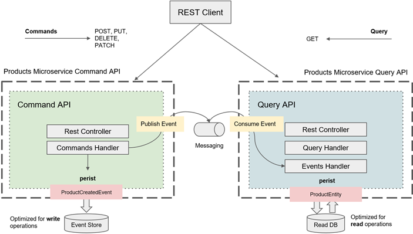
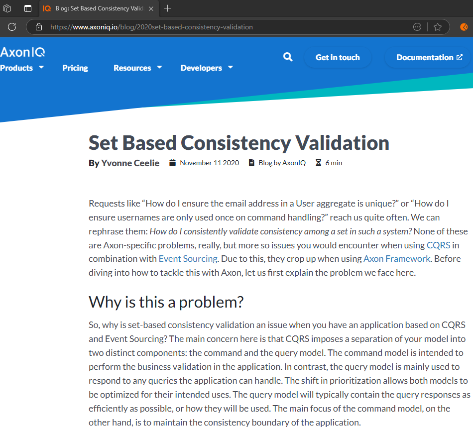
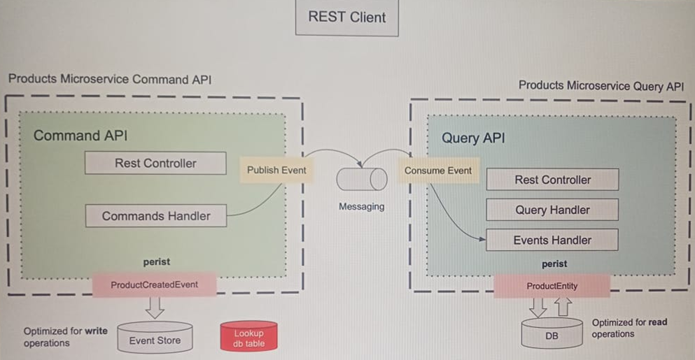

# Sección 13: Validación. ¿Cómo comprobar si un registro existe?

En la siguiente sección aprenderemos a realizar la validación de consistencia basada en conjuntos.

---

## Introducción - Consistencia Basada en Conjuntos

Cuando se utiliza patrones de diseño en la construcción de microservicios seguros, una pregunta muy común que se hacen
los desarrolladores es
`¿cómo compruebo si ya existe un registro en una tabla de base de datos antes de crear uno nuevo?`.

Por ejemplo, si estamos creando un nuevo producto en nuestro sistema, **¿cómo comprobamos que no exista ya un producto
con el mismo `ID de producto` o el mismo `title`?, etc.** Esta es una pregunta muy válida porque en las aplicaciones
seguras los modelos de comando y consulta están segregados y para crear un nuevo producto la aplicación cliente enviará
una petición HTTP a una `API de Comandos`. Por otro lado, para consultar los detalles de un producto, una aplicación
cliente enviará una solicitud HTTP a una `API de consulta`. Por lo tanto, existe una separación muy clara de
responsabilidades entre ambas.

Al crear un nuevo producto, la API de cliente primero persistirá un evento en el almacén de eventos (`Event Store`) y
solo después de que el evento se persiste publicará un evento para sincronizar los datos entre el `almacén de eventos`
y la `base de datos de consulta`.

La comunicación entre `Command API` y la `Query API` se realiza mediante mensajería de eventos, que no es instantánea
y la sincronización entre los dos modelos puede llevar algún tiempo debido a la mensajería de eventos.

La coherencia entre los dos modelos es eventual y no es instantánea. Por lo tanto, si en la aplicación segura, la
comunicación entre el Comando y la API de Consulta está dirigida por eventos. Para consultar los detalles del
producto tenemos que ir a través de una API de Consulta.



> **¿Cómo puede el Command API comprobar rápidamente si los registros ya existen antes de persistir un evento en el
> almacén de eventos?**

La solución a este problema se analiza en detalle en uno de los artículos del sitio web de `Axon framework`. Puede
encontrarlo buscando `Set Based Consistency Validation` en Google.

[](https://www.axoniq.io/blog/2020set-based-consistency-validation)

Este problema no tiene nada que ver con `Axon framework` sino con el `patrón de diseño Secures`. Y este artículo trata
de una solución que puedes implementar si estás construyendo tu aplicación con `Axon Framework`.

> En las siguientes lecciones de vídeo, lo implementaremos en nuestra aplicación.

Así que aquí, lo que vamos a hacer, porque el modelo de comandos puede contener cualquier forma de modelo de datos,
vamos a introducir una pequeña tabla de búsqueda que contendrá IDs de productos y títulos de productos.



Esta nueva tabla de consulta (`Lookup db table`) formará parte del lado de comandos y no será expuesta por la API de
consulta. Por lo tanto, la aplicación cliente que se comunique con la API de consulta no podrá consultar esta tabla de
consulta, solo será utilizado por el lado del comando.

Cuando la API de comandos gestiona el comando `CreateProductCommand`, primero consulta la tabla de búsqueda para saber
si ya existe el producto con el mismo ID y título; en caso afirmativo, si la tabla de búsqueda contiene el mismo
ID de producto y el título, lanzaremos una excepción y el comando no se procesará. El almacén de eventos no se
actualizará y el nuevo producto no persistirá en la base de datos de consultas. Pero si la tabla de búsqueda no
contiene los detalles de este producto, entonces se procesará el comando `CreateProductCommand` y se creará el nuevo
producto. El título y el ID de producto de un nuevo producto se mantendrán en la tabla de consulta, ¿de acuerdo?

Así pues, algunas cosas importantes sobre esta tabla de consulta.

- No debe contener exactamente los mismos detalles de producto que tiene la base de datos de lectura.
- Esta tabla de búsqueda solo debe almacenar los campos de producto necesarios para buscar el registro y ver si existe.
  Como, por ejemplo, el ID del producto o el título del producto.
- No es necesario almacenar el precio, la cantidad u otros detalles del producto.
- Si la aplicación cliente emite un comando para actualizar el título del producto, por ejemplo, y el título del
  producto es el campo por el que se busca un registro en esta tabla de base de datos de consulta, entonces tendrá que
  actualizar este campo tanto en la tabla de consulta como en su base de datos de consulta. Por lo tanto, los campos
  por los que se consulta el registro en la tabla de consulta deben ser coherentes con la base de datos principal de
  productos leídos.

Ahora, **¿cómo consultamos esta tabla de consulta antes de que el gestor de órdenes procese la orden?** Y la respuesta
es, utilizamos el `interceptor` de envío de mensajes que ya hemos implementado en una de las lecciones de vídeo
anteriores.

El interceptor de envío de mensajes interceptará el comando antes de que sea procesado por el método del manejador de
comandos (`Commands Handler`). Utilizará el repositorio JPA para consultar la tabla de búsqueda y, si el registro ya
existe, el comando se bloqueará.

**¿Cómo vamos a escribir en esta tabla de consulta?**, implementaremos un manejador de eventos adicional que persistirá
el `ID del producto` y el `título` del producto en esta tabla de base de datos cuando el método del `Command Handler`
publique el evento `ProductCreatedEvent`.

## Crea la entidad Product Lookup

En el apartado anterior analizamos que debíamos crear una base de datos (`Lookup db table`) que almacene el `product Id`
y el `title` como una manera de identificar si un producto ya fue registrado, de esta manera evitaríamos registrar un
producto con los mismos datos.

En este apartado crearemos la entidad que nos permitirá guardar los identificadores de cada producto guardado.

````java

@AllArgsConstructor
@NoArgsConstructor
@Builder
@Data
@Entity
@Table(name = "products_lookup")
public class ProductLookupEntity {
    @Id
    private String productId;

    @Column(unique = true)
    private String title;
}
````

## Crea el repositorio para el Product Lookup

Definimos un `query method` a través del cual buscaremos un `ProductLookupEntity` ya sea por su id o por su título.

````java
public interface ProductLookupRepository extends JpaRepository<ProductLookupEntity, String> {
    Optional<ProductLookupEntity> findByProductIdOrTitle(String productId, String title);
}
````

## Crea un ProductLookupEventHandler

Para persistir la información en la tabla de base de datos de búsqueda (`Lookup db table`) de productos en el momento
en el que se crea un nuevo producto tendremos que crear un controlador de eventos (`Event Handler`). Este event handler
será utilizado por la `API de comandos` para manejar el `ProductLookupCreatedEvent` y persistirlo en la tabla de base
de datos de búsqueda de productos en los campos que necesitamos.

La tabla de base de datos de búsqueda (`Lookup db table`) de productos no será utilizada por la `Query API` y se
sugiere que el modelo de búsqueda de productos forme parte únicamente del `Command API`. Así que voy a crear un método
de gestión independiente que formará parte de la API de comandos y será responsable de la persistencia de la información
en la tabla de búsqueda de productos.

Iniciaremos agregando la siguiente configuración en el `application.yml` del `product-service`. En esta configuración
estamos definiendo un `procesador de eventos` en `Axon Framework` llamado `product-group`.

````yml
axon:
  eventhandling:
    processors:
      product-group:
        mode: subscribing
````

1. `axon.eventhandling.processors.product-group`
    - Estamos configurando un procesador de eventos con el nombre `product-group`.
    - Este nombre coincide con el valor usado en `@ProcessingGroup("product-group")` en las clases controladoras de
      eventos (más adelante veremos dónde usaremos esta anotación).

2. `mode: subscribing`
    - Indica que este procesador de eventos funcionará en modo suscriptor (`subscribing`).
    - En este modo, el procesador de eventos se suscribe directamente a la cola de eventos del `Event Bus` y maneja los
      eventos de manera síncrona en el mismo hilo donde se publican.

#### Implicaciones del modo subscribing:

- `Procesamiento inmediato`: Los eventos se manejan en el mismo hilo en el que se publican.
- `Menor latencia`: Ideal si necesitas manejar eventos en tiempo real sin depender de almacenamiento intermedio.

Ahora crearemos la clase `ProductLookupEventsHandler` que manejará el evento `ProductCreatedEvent`.

- Esta clase escucha eventos del tipo `ProductCreatedEvent`.
- Guarda una entidad `ProductLookupEntity` en la base de datos a través del repositorio `ProductLookupRepository`.
- `Propósito`: es un manejador para mantener una tabla auxiliar (índice de productos por id y title) para búsqueda
  rápida.

````java

@RequiredArgsConstructor
@ProcessingGroup("product-group")
@Component
public class ProductLookupEventsHandler {

    private final ProductLookupRepository productLookupRepository;

    @EventHandler
    public void on(ProductCreatedEvent event) {
        ProductLookupEntity productLookupEntity = ProductLookupEntity.builder()
                .productId(event.getProductId())
                .title(event.getTitle())
                .build();

        this.productLookupRepository.save(productLookupEntity);
    }

}
````

La anotación `@ProcessingGroup("product-group")` en `Axon Framework` tiene un propósito clave: **agrupar los
manejadores de eventos bajo un mismo procesador de eventos.** En ese sentido, necesitamos agregar esta anotación
a la clase `ProductEventsHandler`, ya que también está manejando el evento `ProductCreatedEvent`.

````java

@RequiredArgsConstructor
@ProcessingGroup("product-group")
@Component
public class ProductEventsHandler {

    private final ProductRepository productRepository;

    @EventHandler
    public void on(ProductCreatedEvent event) {

        ProductEntity productEntity = ProductEntity.builder()
                .productId(event.getProductId())
                .title(event.getTitle())
                .price(event.getPrice())
                .quantity(event.getQuantity())
                .build();

        this.productRepository.save(productEntity);
    }
}
````

1. Las clases `ProductLookupEventsHandler` y `ProductEventsHandler` comparten el mismo grupo de procesamiento
   (`product-group`).

    - Esto significa que ambas clases serán manejadas por el mismo procesador de eventos llamado `product-group`, que
      definiste en `application.yml` como `subscribing`.
    - Como el procesador está en modo `subscribing`, estas clases manejarán los eventos en el mismo hilo en el que se
      publican.

2. `Axon` asegura un procesamiento coordinado de eventos.

    - Si estuvieras en modo `tracking`, el grupo permitiría la reanudación y recuperación de eventos en caso de fallos.
    - También ayuda a manejar la consistencia transaccional, ya que todos los manejadores de un mismo `@ProcessingGroup`
      comparten la misma transacción (cuando es aplicable).

## MessageDispatchInterceptor: busca si un producto ya está registrado o no

Cuando la aplicación cliente envía una petición para crear un nuevo producto, queremos que nuestro microservicio
compruebe primero si dicho producto ya existe o no.

Hasta este punto hemos escrito código para mantener los detalles del producto en la tabla de búsqueda de productos
(`Lookup db table`). En este apartado vamos a consultar dicha tabla para saber si el producto ya existe o no. Entonces,
para comprobar si el producto ya está en la tabla de la base de datos utilizaremos el interceptor de envío de mensajes
que creamos anteriormente (`MessageDispatchInterceptor`).

Recordemos que anteriormente creamos la clase interceptora `CreateProductCommandInterceptor` que implementa el
`MessageDispatchInterceptor`. En esta clase realizábamos validaciones de los atributos del comando
`CreateProductCommand` pero como esas validaciones ya la estamos realizando a través del uso de anotaciones como el
` @NotBlank`, `@Min`, `@Max`, etc. y su activación con el `@Valid` en su clase controladora `ProductCommandController`,
en esta clase ya no sería necesaria volver a realizar dichas validaciones, por lo tanto, las eliminamos y únicamente
usamos esta clase para poder verificar si un producto ya fue registrado o no. En caso de que ya haya sido registrado
lanzar una excepción, en caso contrario, continuamos con el flujo.

````java

@Slf4j
@RequiredArgsConstructor
@Component
public class CreateProductCommandInterceptor implements MessageDispatchInterceptor<CommandMessage<?>> {

    private final ProductLookupRepository productLookupRepository;

    @Nonnull
    @Override
    public BiFunction<Integer, CommandMessage<?>, CommandMessage<?>> handle(@Nonnull List<? extends CommandMessage<?>> messages) {
        return (integer, commandMessage) -> {

            log.info("Comando interceptado: {}", commandMessage.getPayloadType());

            if (CreateProductCommand.class.equals(commandMessage.getPayloadType())) {

                CreateProductCommand payload = (CreateProductCommand) commandMessage.getPayload();

                Optional<ProductLookupEntity> optionalProductLookup = this.productLookupRepository.findByProductIdOrTitle(payload.getProductId(), payload.getTitle());
                if (optionalProductLookup.isPresent()) {
                    throw new IllegalStateException("Product with productId %s or title %s already exist".formatted(payload.getProductId(), payload.getTitle()));
                }

            }

            return commandMessage;
        };
    }
}
````