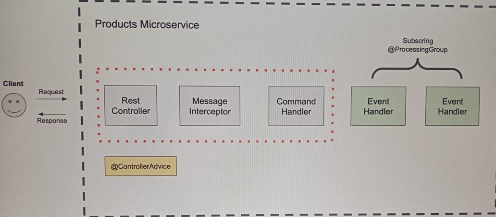
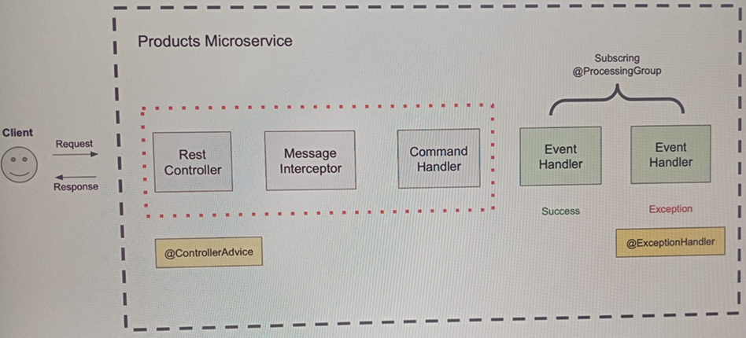
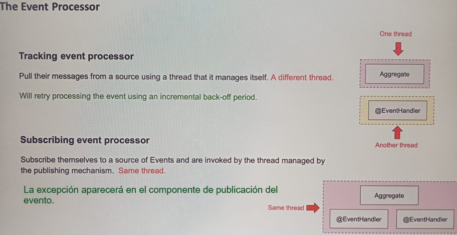

# Sección 14: Handle Error & Rollback Transaction

---

## Error Handling: Introducción

En las siguientes lecciones, aprenderá cómo manejar una excepción que es lanzada en el método manejador de
eventos y cómo hacer que retroceda los cambios que ha hecho en la tabla de la base de datos.

Ahora, el manejo de errores que vamos a discutir en los siguientes videos se hace dentro del mismo microservicio.
Hablaremos de cómo manejar un error y cómo revertir una transacción que se extiende a través de múltiples
microservicios distribuidos, pero en una sección diferente, cuando hablemos del patrón de diseño.

Pero en esta sección, hablaremos de cómo manejar un error en el método manejador de eventos y cómo revertir los cambios
que se hacen en un método manejador de eventos diferente.

Esto es muy útil cuando se tienen varios métodos de control de errores y se desea deshacer los cambios realizados en
todos los controladores de errores que se encuentran en el mismo grupo de procesamiento.

Ya has visto cómo manejar una excepción en la clase controladora usando las sentencias try y catch. Lo más probable es
que tu clase controladora tenga múltiples puntos de servicio web y puedas manejar las excepciones en cada uno de tus
puntos de servicio web por separado.

Si lo necesitas, puedes definir una clase separada de manejador de excepciones que esté anotada con la anotación
`@ControllerAdvice` y usar esa clase para manejar diferentes excepciones en un solo lugar. Esto te ayudará a tener
menos citas en cada uno de tus métodos en la clase controladora porque no necesitarás tener try y catch en cada método.

Todas las excepciones se gestionarán en una clase central de gestión de excepciones con una anotación de asesoramiento
de controlador. La sentencia try y catch en los métodos del controlador o en una clase manejadora de excepciones
centralizada te ayudará a manejar las excepciones que se lanzan en la propia clase controladora en el interceptor de
mensajes que hemos creado o en el método manejador de comandos que hemos definido en la clase agregada.

Pero a menos que escribamos un poco más de código Java, no le ayudará a manejar las excepciones que se lanzan en los
métodos manejadores de eventos.

Cuando se lanzan excepciones en los métodos manejadores de eventos, el comportamiento por defecto es bloquear un
mensaje de error y continuar la ejecución. Y debido a que el código y el método manejador de comandos fue ejecutado con
éxito, el evento para crear un nuevo producto tuvo lugar y la aplicación cliente recibirá una respuesta exitosa sin
importar el error en el método manejador de eventos.



Si se lanza una excepción y no fue manejada en el método manejador de eventos, no impedirá la ejecución de otros
manejadores de eventos. Se bloqueará una excepción pero la ejecución continuará y el código en otros métodos manejadores
de eventos en el mismo grupo de procesamiento continuará también.

El mensaje de excepción lanzado en el método manejador de eventos tampoco será manejado por la sentencia try y catch en
la clase del controlador o en la clase manejadora de excepciones del `@ControllerAdivice` centralizado.

No se manejará allí a menos que escribamos un poco más de código para cambiar ese comportamiento. Ciertamente, puedes
atrapar un error en el método manejador de eventos usando try y catch y hacer algo al respecto para recuperarte y si es
necesario, también puedes crear métodos manejadores de errores separados en la clase manejadora de eventos para manejar
diferentes excepciones y hacer algo al respecto.



Y para hacer eso en la clase manejadora de eventos, crearás uno o múltiples métodos anotados con la anotación manejadora
de excepciones. Pero si quieres que un mensaje de excepción se propague hasta un método del controlador o hasta una
clase de asesoramiento del controlador, tendrás que escribir un código adicional para configurar el procesador de
eventos para que propague la excepción, de modo que puedas capturarla en un lugar diferente y luego volver a lanzar esa
excepción para que bloquee el flujo completo.

Para ello, utilizaremos el `ListenerInvocationErrorHandler` que proporciona `Axon Framework`. Si lo haces, puedes
detener la ejecución en el método manejador de eventos tan pronto como se produzca la excepción. Soplar la ejecución en
todos los métodos manejadores de eventos, manejar y error en la clase controlador y, a continuación, devolver un mensaje
de error personalizado a declinar la aplicación.

La transacción se revertirá y todos los cambios en la base de datos que se prepararon para su ejecución también se
revertirán y no se confirmarán. Para que esto funcione, necesitaremos configurar nuestros métodos manejadores de eventos
para que estén en el mismo grupo de procesamiento que está configurado para usar el procesador de eventos suscriptor.

El procesador de eventos es un componente que se encarga de gestionar los aspectos técnicos de proporcionar los eventos
a sus manejadores de eventos. Y en el momento de grabar estas lecciones en vídeo, los procesadores de eventos vienen
aproximadamente en dos formas, el `seguimiento (tracking)` y la `suscripción (subscribing)`.

Los procesadores de eventos suscriptores `(subscribing event processor)` se suscriben a una fuente de eventos que son
invocados por el hilo gestionado por el mecanismo de publicación. Por otro lado, los procesadores de eventos de
seguimiento `(Tracking event processor)` extraen sus mensajes de una fuente utilizando un hilo que gestiona él mismo.



Y por defecto, las excepciones levantadas por los manejadores de eventos son bloqueadas y el procesamiento continúa con
los siguientes eventos.

En el caso del procesador de eventos de seguimiento, esto significa que el procesador pasará al modo de error, liberará
el testigo y volverá a intentar un evento en un intervalo incremental que comienza en un segundo hasta un máximo de 60
segundos. Seguirá intentando procesar ese evento. Comenzará en un segundo y se duplicará tras cada intento hasta
alcanzar un tiempo de espera máximo de 60 segundos por intento. Esta cantidad de tiempo garantiza que si otro nodo es
capaz de procesar eventos con éxito, tendrá la oportunidad de reclamar el token necesario para procesar el evento.

Un procesador de eventos suscrito informará de un error de publicación al componente que proporcionó un evento. Hará que
una excepción burbujee hasta el componente de publicación del evento permitiéndole tratarlo en consecuencia.

Si propagamos una excepción hasta el final, podemos hacer retroceder toda la transacción. Para poder deshacer toda la
transacción, en las siguientes lecciones en vídeo utilizaremos el procesador de eventos de suscripción para gestionar
sus manejadores de eventos en la clase manejadora de eventos de producto.

## Crea una clase centralizada para el manejo de errores

En este apartado vamos a crear la clase que puede manejar los mensajes de error lanzados desde cualquier controlador en
su microservicio. Esto es, gracias a que estamos anotando la clase con `@RestControllerAdvice` y a cada método lo
anotamos con `@ExceptionHandler`.

````java

@RestControllerAdvice
public class ProductServiceErrorHandler {

    @ExceptionHandler(IllegalStateException.class)
    public ResponseEntity<Object> handleIllegalStateException(IllegalStateException ex, WebRequest request) {
        return ResponseEntity.status(HttpStatus.BAD_REQUEST).body(ex.getMessage());
    }

    @ExceptionHandler(Exception.class)
    public ResponseEntity<Object> handleGenericException(Exception ex, WebRequest request) {
        return ResponseEntity.status(HttpStatus.INTERNAL_SERVER_ERROR).body(ex.getMessage());
    }

}
````

Ahora, vamos a nuestro controlador `ProductCommandController` y realizamos una pequeña modificación. Recordemos que
anteriormente dentro del método `createProduct()` hacíamos uso del bloque `try-catch` para capturar la excepción
ocurrida, pero ahora, con esta nueva implementación ya no la necesitamos, dado que nuestra clase
`ProductServiceErrorHandler` se encargará de manejar los errores que se lancen.

Por lo tanto, nuestra clase controladora quedaría así, sin ningún bloque `try-catch` (lo dejaré comentado solo para la
documentación).

````java

@RequiredArgsConstructor
@RestController
@RequestMapping(path = "/api/v1/products")
public class ProductCommandController {

    private final CommandGateway commandGateway;

    @PostMapping
    public String createProduct(@Valid @RequestBody CreateProductRestModel request) {
        CreateProductCommand createProductCommand = CreateProductCommand.builder()
                .price(request.getPrice())
                .quantity(request.getQuantity())
                .title(request.getTitle())
                .productId(UUID.randomUUID().toString())
                .build();

//        String returnValue;
//        try {
//            returnValue = this.commandGateway.sendAndWait(createProductCommand);
//        } catch (Exception e) {
//            returnValue = e.getLocalizedMessage();
//        }
//        return returnValue;
        return this.commandGateway.sendAndWait(createProductCommand);
    }
}
````

## Prueba cómo funciona nuestra clase centralizada para el manejo de errores

Ejecutaremos las aplicaciones en el siguiente orden.

1. Contenedor de Postgres
2. Contenedor de Axon Server
3. Discovery Server
4. Product Service
5. Gateway Server

A continuación, tratamos de registrar un producto cuyo título ya fue registrado anteriormente.

````bash
$ curl -v -X POST -H "Content-Type: application/json" -d "{\"title\": \"Disco Duro SSD\", \"price\": 500, \"quantity\": 2}" http://localhost:8080/api/v1/products
>
< HTTP/1.1 400 Bad Request
< Content-Type: text/plain;charset=UTF-8
< Content-Length: 97
< Date: Tue, 25 Feb 2025 16:02:01 GMT
<
Product with productId 894229d1-cf7d-41c8-a7a8-2f0e5940b7af or title Disco Duro SSD already exist
````

Como observamos, nos está retornando el código de estado `400 Bad Request`, mismo que fue definido en nuestra clase
manejadora de excepciones anotado con `@RestControllerAdvice`.

## Devolver un objeto de error personalizado

Creamos una clase personalizada que será enviada al cliente cada vez que ocurra una excepción. En mi caso, utilizaré
un `record`, dado que únicamente quiero un objeto que contenga información inmutable, pero fácilmente podría haber
usado una clase tradicional `class` con anotaciones de `lombok`.

````java
public record ErrorMessage(LocalDateTime timestamp,
                           int status,
                           String message) {
}
````

En nuestra clase manejadora de excepciones, utilizamos el record `ErrorMessage` para construir la información que
enviaremos al cliente, de esa forma, estaremos enviando un objeto que se transformará en un `JSON` en lugar de enviarle
un `String` como lo habíamos venido haciendo antes.

````java

@RestControllerAdvice
public class ProductServiceErrorHandler {

    @ExceptionHandler(IllegalStateException.class)
    public ResponseEntity<Object> handleIllegalStateException(IllegalStateException ex, WebRequest request) {
        ErrorMessage errorMessage = new ErrorMessage(LocalDateTime.now(), HttpStatus.BAD_REQUEST.value(), ex.getMessage());
        return ResponseEntity.status(HttpStatus.BAD_REQUEST).body(errorMessage);
    }

    @ExceptionHandler(Exception.class)
    public ResponseEntity<Object> handleGenericException(Exception ex, WebRequest request) {
        ErrorMessage errorMessage = new ErrorMessage(LocalDateTime.now(), HttpStatus.INTERNAL_SERVER_ERROR.value(), ex.getMessage());
        return ResponseEntity.status(HttpStatus.INTERNAL_SERVER_ERROR).body(errorMessage);
    }

}
````

Ahora, para probar el funcionamiento de nuestra clase personalizada, ejecutamos las aplicaciones en el siguiente orden.

1. Contenedor de Postgres
2. Contenedor de Axon Server
3. Discovery Server
4. Product Service
5. Gateway Server

Realizamos una petición a nuestro microservicio de productos, donde tratamos de registrar un producto existente.

````bash
$ curl -v -X POST -H "Content-Type: application/json" -d "{\"title\": \"Disco Duro SSD\", \"price\": 500, \"quantity\": 2}" http://localhost:8080/api/v1/products | jq
>
< HTTP/1.1 400 Bad Request
< transfer-encoding: chunked
< Content-Type: application/json
< Date: Tue, 25 Feb 2025 17:16:45 GMT
<
{
  "timestamp": "2025-02-25T12:16:45.4361096",
  "status": 400,
  "message": "Product with productId 0e7a1bdb-6628-4dc3-a53c-97e56eb49523 or title Disco Duro SSD already exist"
}
````

## Manejo del CommandExecutionException

En este apartado manejaremos una excepción que es lanzada por el método `@CommandHandler` en la clase
`ProductAggregate`. Para ser exactos, vamos a lanzar intencionalmente un error desde el método anotado con
`@CommandHandler` para ver su comportamiento.

````java

@Slf4j
@NoArgsConstructor
@Aggregate
public class ProductAggregate {

    @AggregateIdentifier
    private String productId;
    private String title;
    private BigDecimal price;
    private Integer quantity;

    @CommandHandler
    public ProductAggregate(CreateProductCommand createProductCommand) throws Exception {
        if (createProductCommand.getPrice().compareTo(BigDecimal.ZERO) <= 0) {
            throw new IllegalArgumentException("El precio no puede ser menor o igual a cero");
        }

        if (Objects.isNull(createProductCommand.getQuantity()) || createProductCommand.getQuantity() < 0) {
            throw new IllegalArgumentException("La cantidad debe ser mayor o igual a cero");
        }

        if (Objects.isNull(createProductCommand.getTitle()) || createProductCommand.getTitle().isBlank()) {
            throw new IllegalArgumentException("El título no puede estar vacío");
        }

        ProductCreatedEvent productCreatedEvent = new ProductCreatedEvent();
        productCreatedEvent.setProductId(createProductCommand.getProductId());
        productCreatedEvent.setTitle(createProductCommand.getTitle());
        productCreatedEvent.setPrice(createProductCommand.getPrice());
        productCreatedEvent.setQuantity(createProductCommand.getQuantity());

        AggregateLifecycle.apply(productCreatedEvent);

        if (true) throw new Exception("An error took place in the CreateProductCommand @CommandHandler");
    }

    /* other codes */
}
````

Si ejecutamos el código anterior, vamos a ver que la excepción se va a lanzar sí o sí, por el `if(true)`, y es lo que
queremos para ver qué sucede. Entonces, como se ha producido la excepción, el flujo para crear un nuevo producto se
detendrá. El `ProductCreatedEvent` que creamos y al cual lo aplicamos `AggregateLifecycle.apply(productCreatedEvent)`
en este `ProductAggregate` no se ejecutará. Y aunque la excepción se produzca después de llamar al método `apply()`,
el evento `ProductCreatedEvent` no se guardará en el almacén de eventos `(EventStore)`. Esto se debe a que cuando se
llama al método `apply()`, `Axon Framework` no persiste inmediatamente este evento en el almacén de eventos, sino que
solo pone en escena este evento para su ejecución y como se produce un error, la transacción se revertirá y no se
procesará ninguno de los eventos.

Ahora, para lanzar un error en la clase anterior, estamos usando la clase `Exception`, también podríamos crear una
excepción personalizada y luego lanzar un objeto de nuestra excepción personalizada, pero cuando un error es lanzado
desde el `@CommandHandler` o desde el `@QueryHandler`, entonces `Axon Framework` transforma este error en un
`CommandExecutionException` o en un `QueryExecutionException`.

Como se explica en la documentación de `Axon Framework` para el manejo de errores la utilidad de este manejador
dedicado a la ejecución de excepciones se hace evidente en un entorno de aplicaciones distribuidas donde, por ejemplo,
hay una aplicación dedicada a tratar con comandos y otra aplicación se ocupa de la parte de consultas y debido a la
segregación de aplicaciones perderá la certeza de que ambas aplicaciones pueden acceder a las mismas clases. Para apoyar
y fomentar este desacoplamiento, Axon generalmente encontrará cualquier excepción, que es el resultado de un comando
o un manejo de consulta.

Ahora, en nuestra clase centralizada que maneja las excepciones agregamos un método para capturar la excepción
`CommandExecutionException`, que según dijimos, se lanza a partir de que en el método anotado con `@CommandHandler`
lanza una excepción cualquiera, y es `Axon Framework` que captura esa excepción y lo transforma en un
`CommandExecutionException`. Lo mismo sucedería si en un método anotado con `@QueryHandler` se lanza una excepción,
`Axon Framework` lo transformaría en un `QueryExecutionException`.

````java

@RestControllerAdvice
public class ProductServiceErrorHandler {

    @ExceptionHandler(IllegalStateException.class)
    public ResponseEntity<Object> handleIllegalStateException(IllegalStateException ex, WebRequest request) {
        ErrorMessage errorMessage = new ErrorMessage(LocalDateTime.now(), HttpStatus.BAD_REQUEST.value(), ex.getMessage());
        return ResponseEntity.status(HttpStatus.BAD_REQUEST).body(errorMessage);
    }

    @ExceptionHandler(CommandExecutionException.class)
    public ResponseEntity<Object> handleCommandExecutionException(CommandExecutionException ex, WebRequest request) {
        ErrorMessage errorMessage = new ErrorMessage(LocalDateTime.now(), HttpStatus.BAD_REQUEST.value(), ex.getMessage());
        return ResponseEntity.status(HttpStatus.BAD_REQUEST).body(errorMessage);
    }

    @ExceptionHandler(Exception.class)
    public ResponseEntity<Object> handleGenericException(Exception ex, WebRequest request) {
        ErrorMessage errorMessage = new ErrorMessage(LocalDateTime.now(), HttpStatus.INTERNAL_SERVER_ERROR.value(), ex.getMessage());
        return ResponseEntity.status(HttpStatus.INTERNAL_SERVER_ERROR).body(errorMessage);
    }

}
````
