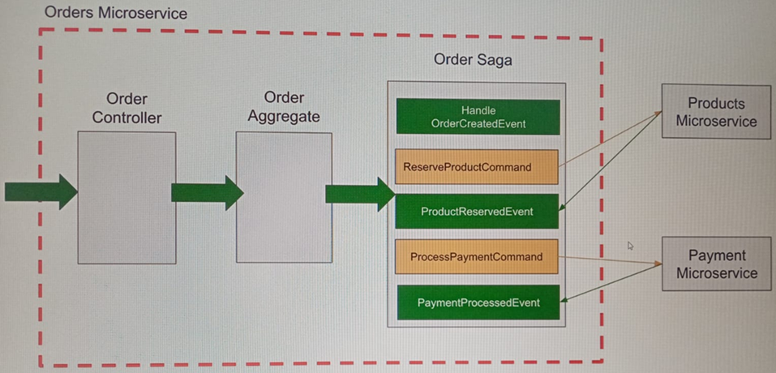
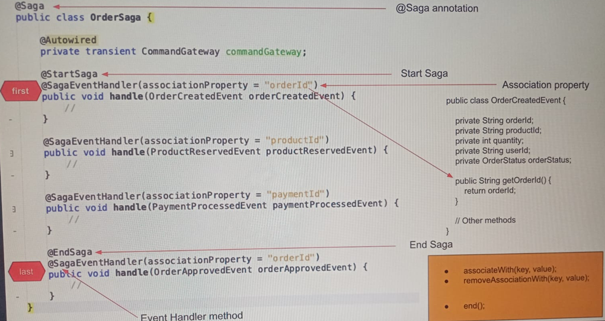

# Sección 16: SAGA basada en Orquestación - Reservar producto en stock

---

## Introducción

En esta sección comenzaremos a trabajar en la `SAGA basada en la orquestación` para el flujo de creación de órdenes.
Implementaremos nuestra SAGA de órdenes dentro del microservicio de órdenes, aunque podríamos haberlo hecho en una
aplicación aparte.

Nuestra clase Saga de órdenes será un componente de gestión de eventos que gestionará el flujo de creación de pedidos
mediante la gestión de eventos y la publicación de comandos para completar el flujo. Si uno de los pasos en el flujo
no tiene éxito, entonces esta clase Saga gestionará el flujo de operaciones de compensación para revertir los cambios
que se hicieron en este flujo.



## Descripción general de la estructura de clases de saga

Las clases `Saga` están anotadas con la anotación `@Saga`, esto hará que nuestra clase Saga sea un componente e informe
a `Axon Framework` que esta clase es una clase `Saga`.

Dado que la clase Saga gestiona un flujo, tiene un principio y un final, así que la clase Saga tendrá un método que
estará anotada con `@StartSaga` y un método anotado con `@EndSaga`.

La anotación `@StartSaga` indicará el inicio del ciclo de vida de una saga y cuando se gestione el `OrderCreatedEvent`
desencadenará la creación de una nueva saga de pedidos por pasos. Por su parte, la anotación `@EndSaga` indicará el
final del ciclo de vida de la saga.

Una vez que el método que está anotado con `@EndSaga` se ejecuta, la instancia saga no será capaz de recibir y manejar
cualquier nuevo evento.

Una saga se utiliza para gestionar múltiples operaciones que deben realizarse en una única transacción y, una vez que se
completan todas las operaciones del flujo, la saga finaliza y no puede volver a utilizarse.

También se menciona en la recomendación, que la anotación `@EndSaga` solo se puede utilizar para los métodos que están
anotados con la anotación `@SagaEventHandler`. Observe que cada método en esta clase saga, que acepta un objeto de
evento, está anotado con la anotación `@SagaEventHandler`.

Saga es un componente manejador de eventos, maneja eventos y despacha comandos, y esta anotación indica que el método
anotado es un método manejador de eventos para esta instancia de saga.

Y para cada evento, sólo un único método anotado en esta clase estará involucrado. Así, cuando se publique un evento
`OrderCreatedEvent`, se disparará un método manejador de eventos en esta clase saga que acepte el evento de creación de
pedido. Y debido a que este método está anotado con `@StartSaga`, sino que también indicará que este es el comienzo de
nuestro ciclo de vida saga y, finalmente, cuando el evento `OrderApprovedEvent` se publica a continuación, el método
controlador de eventos en nuestra clase saga que acepta la orden aprobada evento se activará.

El método se ejecutará primero y luego, debido a que está anotado con la anotación `@EndSaga`, el ciclo de vida de la
saga finalizará y esta instancia de la clase saga no podrá manejar nuevos eventos.

Ahora, note que cada método manejador de eventos de saga en esta clase tiene un `associationProperty`, esta es una
propiedad muy importante. Debido a que la saga gestiona separaciones entre múltiples microservicios, y debido a que
puede manejar múltiples eventos diferentes, necesitamos decirle a `Axon Framework`, qué instancia de saga utilizar
cuando se publica un evento. `Axon Framework` utilizará esta propiedad de asociación para encontrar la instancia
necesaria de saga y dejar que maneje el evento publicado.

Para asignar un evento a la instancia correcta de saga, `Axon Framework` utilizará el `associationProperty` y necesita
ser un nombre de propiedad que exista en el objeto del evento. Utilizará el método getter del objeto de evento para
obtener la orden y el valor y hacer coincidir el objeto de evento correcto con la instancia de saga correcta.

Es necesario gestionar el `associationProperty` con cada uno de los métodos handler de la clase saga, y si es necesario
esta asociación puede ser creada y eliminada mediante programación.

Un método manejador de eventos puede asociar saga mediante programación utilizando el método `associateWith(key, value)`
y eliminar la asociación utilizando el método `removeAssociationWith(key, value)`. Del mismo modo, con la anotación
`@EndSaga`, si necesitamos `@EndSaga` programáticamente, podemos utilizar un método end.



## Crea la clase OrderSaga

Por lo general la clase `Saga` se crea en el microservicio que inicia el flujo, en nuestro caso lo crearemos en el
`order-service`.

Las clases de `Saga` en `Axon Framework` son serializadas para que el estado de la saga pueda persistirse y restaurarse
cuando sea necesario. Como las instancias de `CommandGateway` no son serializables (porque dependen del contexto
de ejecución de Spring), podría causar errores, por lo tanto, marcarlas como `transient` evita que se intenten
serializar. Entonces, marcar el `CommandGateway` como `transient`, evita que `Axon` intente serializarlo cuando
persiste la saga. Sin esta anotación, `Axon` podría lanzar excepciones relacionadas con la serialización.

````java

@RequiredArgsConstructor
@Saga
public class OrderSaga {

    private final transient CommandGateway commandGateway;
}
````

## @SagaEventHandler, método para el OrderCreatedEvent

En este apartado vamos a manejar el `OrderCreatedEvent`. Cuando una aplicación cliente envía una solicitud para crear
un nuevo pedido, la solicitud es gestionada inicialmente por el controlador de pedidos. El controlador de pedidos
publicará y creará órdenes de pedido que se gestionarán en el agregado de pedidos. El método anotado con
`@CommandHandler` en el `OrderAggregate` validará la orden y si todo está bien publicará el evento `OrderCreatedEvent`
El evento `OrderCreatedEvent` se persistirá en el almacén de eventos y todos los detalles también se publicarán en la
base de datos de lectura porque este `OrderCreatedEvent` también será manejado por el método anotado con
`@EventHandler` del lado de la consulta. Además, queremos que nuestra saga inicie una transacción que agrupe varias
apariciones. Queremos que nuestra saga reserve el producto en stock y procese el pago del usuario. Así que el evento
`OrderCreatedEvent` es un buen lugar para empezar nuestra saga y como la saga es un componente de alerta de eventos
también haremos que maneje el evento `OrderCreatedEvent` para reservar el producto en stock.

````java

@RequiredArgsConstructor
@Saga
public class OrderSaga {

    private final transient CommandGateway commandGateway;

    @StartSaga
    @SagaEventHandler(associationProperty = "orderId")
    public void handle(OrderCreatedEvent orderCreatedEvent) {

    }
}
````

- El `orderId` tiene que ser un atributo de la clase `OrderCreatedEvent`.
- Observar que el método está anotado con `@StartSaga`, dado que este método es el que inicia la saga.

## Crea un nuevo módulo Core API

Estamos listos para hacer que nuestro método manejador de eventos publique un nuevo comando. Este será un nuevo comando
que se utilizará para reservar el producto y el stock. Voy a llamar a este comando `ProductReservedEvent` que será
publicado por el `@SagaEventHandler`, método manejador del `OrderCreatedEvent`. Así, el comando de reserva de producto
será gestionado y procesado por el microservicio de producto y si todo va bien, el microservicio de productos publicará
un evento notificando a saga que el producto ha sido reservado en stock con éxito.

Ahora debido a que son dos microservicios diferentes que harán uso del mismo comando `ProductReservedCommand`, crearé
este comando en un módulo separado, de esta manera el microservicio de pedidos y el microservicio de productos,
utilizarán el mismo comando de la biblioteca compartida.

Así que en este apartado vamos a crear un proyecto compartido que contendrá clases compartidas. Entonces puedo añadir
este proyecto como dependencia de mis otros microservicios.

Creamos un nuevo proyecto desde `Spring Initializr` llamada `core-service`, donde:

- Eliminamos la clase principal `CoreServiceApplication`.
- Eliminamos del `pom.xml` el contenido de la etiqueta `<build></build>`.
- Eliminamos la clase de prueba `CoreServiceApplicationTests`.
- Eliminamos el archivo de propiedades `application.properties`.
- El archivo `pom.xml` debe tener el siguiente contenido.

````xml
<?xml version="1.0" encoding="UTF-8"?>
<project xmlns="http://maven.apache.org/POM/4.0.0" xmlns:xsi="http://www.w3.org/2001/XMLSchema-instance"
         xsi:schemaLocation="http://maven.apache.org/POM/4.0.0 https://maven.apache.org/xsd/maven-4.0.0.xsd">
    <modelVersion>4.0.0</modelVersion>
    <parent>
        <groupId>org.springframework.boot</groupId>
        <artifactId>spring-boot-starter-parent</artifactId>
        <version>3.4.3</version>
        <relativePath/> <!-- lookup parent from repository -->
    </parent>
    <groupId>com.magadiflo</groupId>
    <artifactId>core-service</artifactId>
    <version>0.0.1-SNAPSHOT</version>
    <name>core-service</name>
    <description>Demo project for Spring Boot</description>

    <properties>
        <java.version>21</java.version>
    </properties>
    <dependencies>
        <dependency>
            <groupId>org.springframework.boot</groupId>
            <artifactId>spring-boot-starter</artifactId>
        </dependency>
        <dependency>
            <groupId>org.axonframework</groupId>
            <artifactId>axon-spring-boot-starter</artifactId>
            <version>4.10.3</version>
        </dependency>

        <dependency>
            <groupId>org.projectlombok</groupId>
            <artifactId>lombok</artifactId>
            <optional>true</optional>
        </dependency>
        <dependency>
            <groupId>org.springframework.boot</groupId>
            <artifactId>spring-boot-starter-test</artifactId>
            <scope>test</scope>
        </dependency>
    </dependencies>

</project>
````
