# [Event-Driven Microservices, CQRS, SAGA, Axon, Spring Boot](https://indra.udemy.com/course/spring-boot-microservices-cqrs-saga-axon-framework/)

- Curso tomado de `Udemy` del instructor `Sergey Kargopolov`.
- Aprenda a crear microservicios distribuidos basados en eventos `(Event-driven)`, `CQRS`, `Event Sourcing`, `SAGA` y
  `transactions`.

---

## Descripción general de la arquitectura de microservicios

Supongamos que has empezado a construir tu proyecto como una pequeña aplicación monolítica. Su única aplicación
monolítica se empaqueta como archivo `WAR`, se despliega en un contenedor de `Tomcat` y funciona con una única base de
datos de escala mínima.

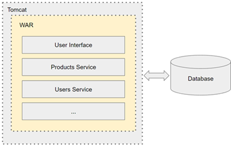

Ahora, con el tiempo, la funcionalidad de la aplicación creció y se hizo muy grande. Su equipo decidió dividir esta gran
aplicación monolítica en microservicios más pequeños.

Cuando su aplicación se divide en varios microservicios diferentes, cada microservicio tendrá su propia base de datos,
a esto se le denomina `patrón de diseño de base de datos por servicio`. Ya no existe una única base de datos que
contenga toda la información sobre productos, usuarios y pedidos en una sola base de datos.

La información del producto estará en la base de datos de productos, la información del usuario estará en la base de
datos de usuarios, y la información del pedido estará almacenada en la base de datos de pedidos.

En caso sea necesario, los microservicios pueden ampliarse. Por ejemplo, si aumenta la carga de un microservicio, puede
ejecutar varias instancias del mismo en el mismo servidor y este será otro patrón de diseño de microservicios que se
llama `múltiples instancias de servicio por host`.

En la imagen anterior podemos ver varios patrones de diseño, como el patrón de diseño de base de datos por servicio, el
patrón de diseño de descubrimiento de servicios, el API Gateway y la configuración centralizada, y hay muchos más con
los que aún podemos encontrarnos, como por ejemplo, rastreo distribuido, circuit breaker, token de acceso, event
sourcing, CQRS, SAGA y muchos más.

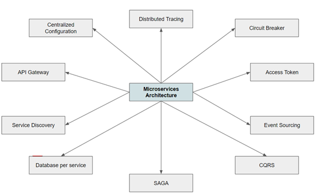

## Microservicios basados en eventos (Event Driven)

La mayoría de las veces cuando dos aplicaciones necesitan comunicarse entre sí, esta comunicación suele ser en forma de
petición y respuesta. Si estas dos aplicaciones son microservicios, entonces normalmente, un microservicio enviará la
petición HTTP a otro microservicio, y luego recibirá la respuesta HTTP. Este tipo de comunicación es aplicable a muchos
casos de uso, pero no a todos.

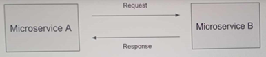

¿Y si tenemos un `microservicio A` que necesita comunicar un mensaje a varios microservicios al mismo tiempo? La
comunicación directa de `request/response` ya no es conveniente en este caso. Si solo hay tres microservicios de
destino, entonces tal vez podamos lidiar con ello. Pero, ¿y si hay docenas de microservicios de destino que necesitan
recibir un mensaje?, ¿y si los microservicios que necesitan recibir un mensaje pueden añadirse más tarde?, ¿cuántos de
ellos se añadirán más tarde? No lo sabemos.

En este tipo de casos de uso, por ejemplo, la comunicación directa de `request/response` HTTP entre dos microservicios
ya no es útil. En este tipo de situaciones, podemos utilizar la `arquitectura basada en eventos (event-driven)`.

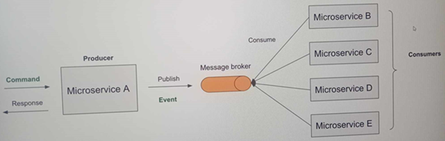

El `microservicio A` que necesite comunicar un mensaje a varios microservicios publicará un mensaje en un componente
`Message Broker`. Los microservicios que estén interesados en recibir este mensaje lo consumirán desde un componente
`message broker` en cuanto esté disponible allí. Este modelo suele denominarse de `productor` y `consumidor`, donde el
`microservicio A` de la izquierda es un `productor` y los microservicios de la derecha son `consumidores`.

Los microservicios están débilmente acoplados y son completamente transparentes entre sí. Puedes conectar tantos
microservicios consumidores como necesites. Sólo tienen que saber qué tipo de mensaje esperar.

Ahora bien, el mensaje que se publica y consume puede ser de distintos tipos. Puede ser un `comando`, un `evento` o una
`consulta`.

Por ejemplo, el `microservicio A` puede recibir un mensaje para hacer algo. Este mensaje puede considerarse una orden.
Cuando el `microservicio A` termine de procesar este comando, publicará un nuevo mensaje, que será un evento y entonces
todos los microservicios que estén interesados en recibir este evento y estén suscritos para recibir este evento, lo
recibirán y lo procesarán.

Y como en esta arquitectura los microservicios se comunican entre sí mediante la publicación y consumo de mensajes o
eventos, se denomina `arquitectura dirigida por mensajes` o `arquitectura dirigida por eventos`.

### ¿Qué es la arquitectura basada en eventos?

La `arquitectura basada en eventos` utiliza eventos para desencadenar y establecer comunicación entre servicios
desacoplados, y es común en las aplicaciones modernas creadas con microservicios. Un `evento` es un cambio de estado, o
una actualización, como un elemento que se coloca en un carro de compras de un sitio web de comercio electrónico. Los
eventos pueden llevar el estado (el elemento comprado, su precio y una dirección de entrega) o pueden ser
identificadores (una notificación de que se envió una orden).

La `arquitectura basada en eventos` o `event-driven architecture (EDA)` es un modelo de diseño de software en el que los
componentes del sistema interactúan entre sí a través de la emisión, recepción y procesamiento de eventos.

Un evento es cualquier cambio significativo en el estado del sistema, como `"un pedido fue creado"`,
`"un usuario actualizó su perfil"` o `"un pago fue procesado"`. En esta arquitectura, los sistemas reaccionan en tiempo
real a los eventos en lugar de operar de manera sincrónica y lineal.

### Componentes principales de una arquitectura basada en eventos

1. `Productor de eventos (Event Producer)`:
    - Genera los eventos cuando ocurre algún cambio en el sistema. Por ejemplo, una API que emite un evento cuando se
      crea un nuevo pedido.

2. `Broker de eventos (Event Broker)`:
    - Actúa como intermediario que transmite y distribuye los eventos a los consumidores interesados. Ejemplos comunes
      incluyen `Kafka`, `RabbitMQ` y `Amazon SNS/SQS`.

3. `Consumidor de eventos (Event Consumer)`:
    - Escucha y responde a los eventos emitidos. Por ejemplo, un servicio que reacciona a un evento de `"pedido creado"`
      para enviar un correo de confirmación.

4. `Eventos`:
    - Datos estructurados que representan un cambio o acción. Generalmente, son mensajes con información del evento,
      como el ID del pedido, el timestamp, etc.

## Transacciones en microservicios

En una aplicación monolítica, implementar transacciones no es muy difícil, especialmente con el soporte de spring
framework. Iniciamos la transacción, realizamos un conjunto de operaciones comerciales y, a continuación, finaliza la
transacción. Si alguno de estos pasos dentro de una misma transacción no tiene éxito, podemos lanzar una excepción y
todas las modificaciones de la base de datos que hayamos realizado se revertirán.

Se trata de una transacción de activos de `todo` o `nada` y dentro de una misma aplicación es relativamente sencilla de
implementar.

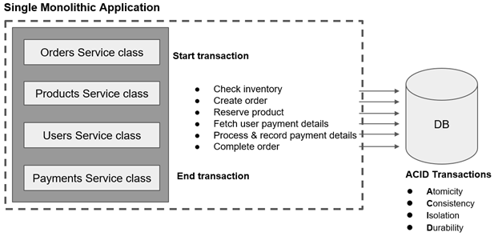

Ahora, revisemos algunas de las propiedades de la `transacción ACID` que utilizamos en la aplicación monolítica.

1. `Atomicidad`, las transacciones son atómicas, lo que significa que todas las operaciones se ejecutan con éxito o todo
   falla a la vez.
2. `Consistencia`, este principio asegura que una transacción llevará la base de datos de un estado válido a otro estado
   válido, respetando todas las reglas y restricciones definidas, como claves primarias, claves foráneas, restricciones
   únicas y validaciones. En otras palabras, después de completar una transacción, la base de datos no debe contener
   datos inválidos o inconsistentes, y debe cumplir con las reglas de integridad definidas en su esquema.
3. `Aislamiento`, la transacción que se esté ejecutando de forma concurrente no puede acceder al estado intermedio de
   otra transacción. Este principio asegura que las transacciones concurrentes no interfieran entre sí y que cada
   transacción se ejecute como si fuera la única operando en la base de datos. Aunque las transacciones pueden
   ejecutarse simultáneamente, el aislamiento garantiza que su resultado sea el mismo que si se ejecutaran de manera
   secuencial.
4. `Durabilidad`, una vez realizada la transacción, los cambios en la base de datos se almacenan de forma duradera. Si
   se produce un error o un fallo del sistema después de realizar la transacción, los cambios realizados en esta
   transacción no se revertirán.

En la arquitectura de microservicios, donde cada microservicio es una aplicación independiente con su propia base de
datos, la ejecución de transacciones de activos es mucho más difícil. Ya no se trata de una única aplicación.

El microservicio se ejecuta en diferentes servidores y se comunican entre sí a través de HTTP y ahora no hay una única
base de datos con la que trabajar. Cada microservicio trabaja con su propia base de datos. Así, para realizar una
transacción que coloque un nuevo pedido en nuestro sistema, varios microservicios tendrán que comunicarse entre sí.

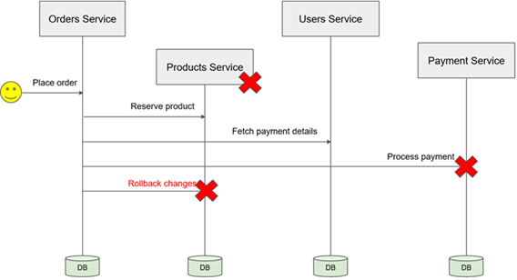

Por ejemplo, un cliente realiza un pedido y el microservicio de pedidos recibe una solicitud y crea un nuevo pedido.
El microservicio de pedidos creará un nuevo registro en su propia base de datos y, si todo es correcto, enviará una
solicitud a un microservicio de productos para reservar el producto seleccionado y las existencias. El Microservicio de
productos, actualizará su propia base de datos para reservar el producto y el stock. Y si esta operación también tiene
éxito, entonces se enviará la solicitud al microservicio del usuario para obtener los detalles de pago del usuario.
Ahora, esperemos que esta operación también tenga éxito y si es así, entonces se enviará una solicitud para procesar
los datos de pago. Si esta operación falla, la solicitud termina. La operación de colocación de pedidos no tiene éxito
y acabamos con varias bases de datos en un estado incoherente. Tenemos un registro de pedido abierto en la base de datos
de pedidos y tenemos un producto reservado en la base de datos de productos. El producto no se compró y no está
disponible para que otros clientes lo compren también porque está reservado.

Para arreglar la situación necesitamos implementar un `rollback de transacciones` y esta transacción tendrá que tener
lugar entre múltiples microservicios y existen riesgos. Por ejemplo, el microservicio de productos puede fallar y
acabamos con un sistema que tiene datos en un estado no válido.

Para poder construir la lógica de negocio que se distribuye a través de múltiples microservicios y para lograr la
coherencia de datos a través de estos microservicios distribuidos podemos utilizar un `patrón de diseño` que se llama
`SAGA`.

El patrón de diseño `SAGA` es una forma de gestionar la coherencia de datos entre microservicios en escenarios de
transacciones distribuidas.

Hay dos maneras diferentes de implementar el patrón de diseño saga: `coreografía` Y `orquestación`.

## SAGA basada en Coreografía (Choreography)

En la coreografía, no existe un controlador central. Cada microservicio es responsable de realizar su parte del trabajo
y de comunicar los eventos relevantes al resto del sistema. Los servicios reaccionan a estos eventos según su lógica
definida.

Características clave:

- `Descentralización`: Cada microservicio actúa de forma independiente, publicando eventos y reaccionando a eventos de
  otros servicios.
- `Eventos como mecanismo`: La comunicación ocurre a través de un sistema de mensajería o bus de eventos (como `Kafka` o
  `RabbitMQ`).
- `Alta cohesión y bajo acoplamiento`: Los servicios están menos acoplados entre sí, pero dependen del flujo correcto de
  eventos.

Ahora, en este apartado mostraremos un ejemplo del flujo de creación de órdenes. Este diagrama de orden completo es un
ejemplo simplificado solo para demostrar cómo se inician los procesos de negocio en la pila basada en `coreografía`.

Ahora bien, en la `saga basada en coreografías` los microservicios se comunican entre sí intercambiando eventos. Cuando
el microservicio realiza una operación, publica un mensaje de evento en un sistema de mensajería como, por ejemplo, un
un `Message Broker`.

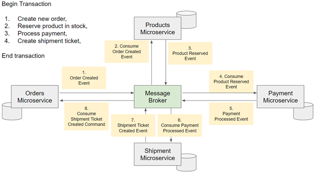

Por ejemplo, cuando se realiza un pedido, el microservicio de pedidos publicará un evento de creación de pedido. Un
microservicio que esté interesado en recibir este evento lo recibirá tan pronto como este evento se publique en el
`message broker`. Ahora, el microservicio de productos se suscribirá para recibir un evento de pedido creado y consumirá
este evento en cuanto se publique. El microservicio de productos consumirá el evento de abono del pedido, realizará
algunas operaciones comerciales para reservar productos en su sistema de inventario, por ejemplo. Y en cuanto esté hecho
el microservicio de producto publicará un nuevo evento que se llamará `Evento Reservado de Producto`. Un microservicio
interesado en recibir el evento de producto reservado consumirá este mensaje, lo procesará y publicará un nuevo evento.
Por ejemplo, el microservicio de pago consumirá el evento de producto reservado, validará y procesará los detalles del
pago y publicará el evento de proceso de pago porque el microservicio de envío está suscrito al evento del proceso de
recepción de pagos, consumirá este mensaje creará un ticket para iniciar el proceso de entrega del producto y publicará
el evento ticket de envío creado. Por último, como el microservicio de pedidos está suscrito a recibir el evento de
creación de ticket de envío, lo consumirá y actualizará el estado del pedido como aprobado.

En la `saga basada en coreografía`, cada microservicio publica en el evento principal que desencadena evento en otro
microservicio. Puede pensar en este evento como una transacción que contiene múltiples transacciones locales.

Por ejemplo, dentro de nuestra transacción única, necesitamos crear una nueva orden de reserva de producto y stock,
procesar el pago, y luego crear la orden de envío. Para que esta transacción tenga éxito, cada paso también debe tener
éxito. Si al menos uno de estos pasos no tiene éxito entonces necesitamos revertir esta transacción y deshacer los
cambios que hayamos realizado en la base de datos. Para eso, el microservicio publicará un evento para realizar una
transacción de compensación. Veamos cómo funciona.

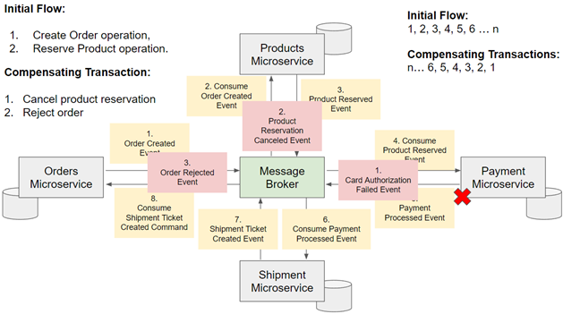

Supongamos que el microservicio de pago no ha podido procesar el pago correctamente porque la tarjeta de crédito del
usuario ha sido rechazada. Esto significa que no podemos aceptar este pedido y no podemos continuar. La transacción
posterior no se ha completado por lo que tenemos que deshacer los pasos anteriores.

Cada microservicio que haya realizado cambios modificadores en el sistema necesitará realizar una transacción
compensatoria para deshacer esto. Las modificaciones y compensaciones se realizan en orden inverso. Debido a que la
transacción ha fallado en el microservicio de pago, el microservicio de pago publicará un evento de autorización de
tarjeta fallida. El microservicio de productos se suscribirá para recibir el evento de autorización de tarjeta fallida
y lo consumirá. El microservicio de productos marcará el producto reservado en una base de datos como disponible de
nuevo y publicará el evento de reserva de producto cancelado. Ahora tenemos este producto disponible para que lo compren
otros clientes, pero seguimos teniendo un pedido abierto en nuestra base de datos de pedidos.

Debido a que el microservicio de productos ha publicado el evento de reserva de producto cancelado nuestro microservicio
de pedidos lo consumirá. Marcaremos la orden abierta como rechazada y si es necesario también puede publicar un evento
de orden rechazado para que otros microservicios que estén interesados en recibir este evento lo consuman. Esto podría
completar los pasos de nuestra saga.

Así que, para resumir algunos puntos importantes de la imagen anterior, cuando uno de los pasos del flujo de la saga
falla, los microservicios comienzan a realizar transacciones compensatorias.

> Las `transacciones de compensación` son operaciones que nuestro microservicio necesita realizar para deshacer los
> cambios de modificación que se hicieron en nuestro sistema. Estas `transacciones de compensación` se realizan en
> `orden inverso`.

## SAGA basada en Orquestación (Orchestration)

En la `saga basada en orquestación` tendrás un microservicio que además de otras clases, también contendrá la clase
`saga`. Esta clase saga actuará como un orquestador o como un gestor de comandos que necesitan ser enviados. Veamos un
ejemplo.

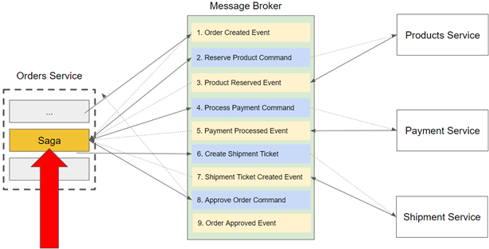

Nuestro microservicio de pedidos recibe una petición http para crear un nuevo pedido. Se creará un nuevo pedido y se
publicará un evento informando de que se ha creado el nuevo pedido. Nuestra saga consumirá este evento y publicará un
comando para reservar producto en stock. El microservicio de productos estará suscrito para recibir el comando para
reservar producto. Lo consumirá, lo procesará y publicará un evento de producto reservado.

Debido a que nuestro `saga` funciona como gestor del flujo será esta saga quien consuma el evento de producto reservado
y publicará un nuevo comando de procesamiento de pago. El microservicio de pago está suscrito para recibir la orden de
proceso de pago, la consumirá, procesará el pago y, si todo es correcto, publicará el evento de pago procesado.
En este paso, un pedido puede marcarse como aprobado y puede iniciarse un nuevo proceso para solicitar el envío del
pedido.

Dependiendo de cómo diseñes tu aplicación, podría ser una nueva saga o sólo unos pasos más en la saga existente. Por
ejemplo, la saga actual puede consumir el evento pago procesado y publicar el comando crear ticket de envío. El
Microservicio de envío consumirá el comando de crear ticket de envío, lo procesará, y si todo es correcto publicará un
evento de ticket de envío creado.

La `saga` consumirá el evento de creación de ticket de envío y publicará el comando de pedido aprobado. Esta vez será
una clase manejadora en el microservicio de pedidos la que consuma este comando y marque el pedido como aprobado en la
base de datos de pedidos. Y si el pedido se aprueba con éxito, se publicará un evento de pedido aprobado. Esto sería
el camino feliz.

Veamos cómo funciona una orquestación con saga cuando se produce un error en una de las etapas.

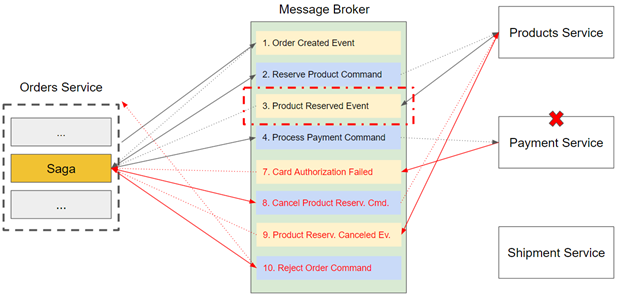

Supongamos que el microservicio de pago no pudo verificar los detalles de pago del usuario y no pudo cobrar al usuario
el producto seleccionado. Debido a que el pago ha fallado, no podemos continuar y no podemos enviar el producto, no
podemos simplemente salir del flujo porque el producto ha sido marcado como reservado en nuestra base de datos.

Si salimos ahora del flujo, el producto seguirá reservado y otros clientes no podrán comprarlo. Dado que la transacción
no es exitosa, necesitamos revertir los cambios que se hicieron en este flujo iniciando una secuencia de eventos
compensatorios. Los eventos compensatorios son acciones que necesitamos hacer para deshacer los cambios en nuestro
sistema que se hicieron durante los pasos previos en esta transacción.

> Recuerda que los `eventos compensatorios` deben realizarse en `orden inverso`.

Así que el primer evento que tenemos que mirar es el evento de producto reservado. Este evento ha cambiado el estado de
nuestro producto en una base de datos de disponible a reservado. Así que tenemos que realizar una transacción de
compensación para actualizar el estado de este producto a disponible. Para ello, el servicio de pago publicará primero
un evento llamado evento de autorización de tarjeta fallida. La Saga consumirá este evento y publicará el comando de
cancelación de reserva de producto. El microservicio de producto consumirá el comando de cancelación de reserva de
producto, actualizará el estado del producto para que vuelva a estar disponible y publicará el evento reserva de
producto cancelado. La Saga consumirá este evento y publicará el comando de pedido rechazado. El Microservicio de
pedidos consumirá el comando de pedido rechazado y actualizará la base de datos cambiando el estado de este pedido de
abierto a rechazado.

## ¿Qué patrón de saga utilizar?

### Saga basada en coreografía

1. `Beneficios`
    - Es útil para flujos de trabajo simples que requieren pocos microservicios y no necesitan una lógica de
      coordinación.
    - No requiere implementación y mantenimiento de servicios adicionales para coordinar transacciones.
    - No introduce un único punto de falla, ya que las responsabilidades se distribuyen entre los participantes de la
      saga.

2. `Desventajas`
    - El flujo de trabajo puede volverse confuso al agregar nuevos pasos y microservicios. Cuantos más pasos haya en una
      transacción, más difícil será rastrear qué participantes de la saga escuchan qué comandos.
    - Existe el riesgo de una dependencia cíclica entre los participantes de la saga porque tienen que consumir los
      comandos de los demás.
    - La prueba de integración es difícil porque todos los servicios deben estar ejecutándose para simular una
      transacción.

### Saga basada en orquestación

1. `Beneficios`
    - Es útil para flujos de trabajo complejos que involucran muchos microservicios.
    - Es más fácil controlar el flujo de actividades.
    - No introduce dependencias cíclicas, ya que el orquestador depende unilateralmente de los participantes de la saga.
    - Los participantes de la saga no necesitan saber acerca de los comandos para otros participantes. La separación
      clara de preocupaciones simplifica la lógica empresarial.

3. `Desventajas`
    - La complejidad adicional del diseño requiere la implementación de una lógica de coordinación.
    - Existe un punto de falla adicional, porque el orquestador administra el flujo de trabajo completo.

## Command Query Responsibility Segregation (CQRS)

En el patrón de diseño `CQRS`, la responsabilidad de los componentes en su aplicación se divide principalmente en dos
partes principales: `comandos` y `consultas`.

Supongamos que tenemos una aplicación Cliente REST que se comunica con nuestro microservicio. Así, cuando una aplicación
cliente se comunica con nuestro microservicio, enviará una petición HTTP, como por ejemplo HTTP post, put, delete o
patch, y también puede enviar una petición HTTP get.

Podemos pensar en peticiones HTTP como `post`, `put`, `delete` o `patch` como `comandos` que realizan ciertas
operaciones y **modifican información en nuestra base de datos.**

Podemos pensar en la petición HTTP `get` como una `consulta` porque **solicita a nuestro microservicio que devuelva
alguna información.**

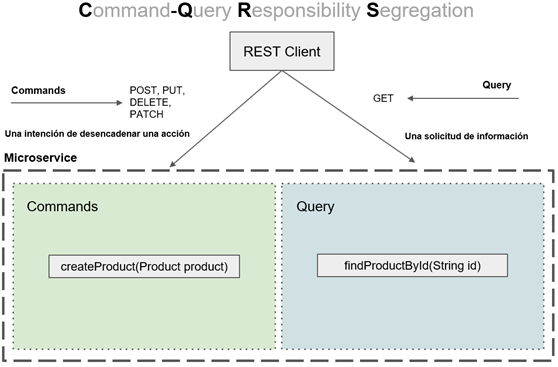

Por lo tanto, esa es una manera fácil de pensar en `CQRS`, pero no es sólo acerca de las peticiones HTTP que vienen de
nuestro cliente REST. A medida que continuemos trabajando con el patrón de diseño `CQRS` en este apartado, verás que
los `comandos` y `consultas` es como se realizará la comunicación dentro del microservicio y también entre
microservicios.

Siempre que queramos que un microservicio ejecute una determinada tarea, emitiremos un nuevo comando y siempre que tu
microservicio necesite devolver alguna información de una base de datos, por ejemplo, utilizaremos una API de consulta.

Por lo tanto, piense en un comando como una intención de desencadenar una acción, por ejemplo, crear un nuevo producto.
Así mismo, piense que una consulta es una petición de información como por ejemplo, buscar producto por ID.

Ahora fíjate que en la imagen anterior, la segregación de comandos y consultas se hace dentro de un único microservicio.
Tenemos un único microservicio que se divide en dos partes principales, comandos y consultas. Si es necesario para
escalar esto, podemos dividir este microservicio en dos microservicios separados.

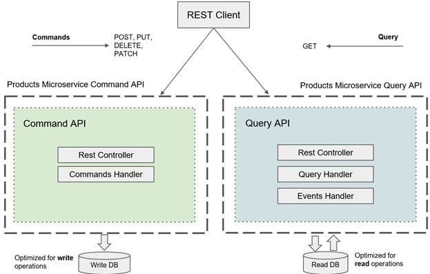

Un microservicio se encargará de los comandos y otro microservicio solo de las consultas. En la imagen anterior se ha
dividido un único microservicio en dos microservicios separados.

En el lado izquierdo, tenemos el microservicio de productos que es responsable de la gestión de comandos y en el lado
derecho, tenemos el microservicio de productos que es responsable de la gestión de consultas.

Cada uno de estos microservicios puede desplegarse independientemente del otro y, si es necesario, podemos iniciar
múltiples instancias de cada uno de estos microservicios.

El microservicio del lado izquierdo que es responsable de manejar los comandos, puede tener un controlador rest que
escuchará las peticiones HTTP como `POST`, `PUT`, `DELETE` o `PATCH`, y tendrá un componente manejador de comandos que
procesará los comandos recibidos. La responsabilidad de este microservicio será aceptar la petición HTTP, validar los
datos y actualizar el estado de la aplicación. La base de datos de este microservicio puede optimizarse para operaciones
de escritura.

Cuando una aplicación cliente necesita solicitar alguna información de nuestro microservicio de productos, se enrutará
una solicitud al microservicio del lado derecho que aceptará la solicitud HTTP `GET`, consultará la base de datos de
lectura y devolverá la información solicitada. La base de datos de este microservicio puede optimizarse para operaciones
de lectura y esto hace que nuestra arquitectura sea aún más flexible.

Si nuestro microservicio recibe muchas operaciones de lectura, podemos optimizar su base de datos para las operaciones
de lectura y, si es necesario, podemos iniciar más instancias de microservicio de consulta para dar servicio a esta gran
cantidad de solicitudes HTTP de lectura.

Ahora, una de estas preguntas que me viene a la mente es `cómo llega la información de la base de datos de escritura en
el lado izquierdo a la base de datos de lectura que está en el lado derecho`. Y la respuesta es con la ayuda de la
mensajería.

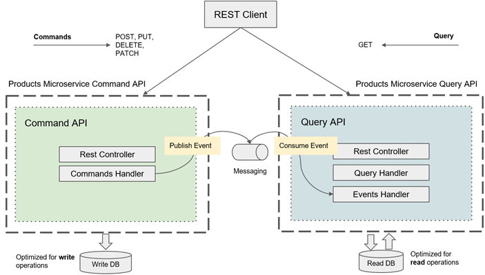

El componente de manejo de comandos en el microservicio de la izquierda procesará el comando, persistirá la información
en la base de datos y luego publicará un mensaje de evento que se almacenará en una cola de mensajes especial que está
fuera de este microservicio y que es global para todos los microservicios.

Por ejemplo, este mensaje de evento puede ser evento de actualización de producto y contendrá información sobre el
estado actualizado de nuestro producto. Todos los microservicios interesados en el evento de actualización del producto
pueden consumir este evento y procesarlo.

Por ejemplo, el microservicio de la derecha tendrá un componente de gestión de eventos que consumirá el evento de
producto actualizado y actualizará la base de datos de lectura para asegurarse de que la información que tiene es
coherente con la información que está en la base de datos de escritura y como la comunicación entre estos microservicios
se realiza a través de una cola de mensajería, conseguimos transparencia en la localización.

Los dos microservicios desconocen por completo la ubicación del otro. Un microservicio que publica un mensaje de evento
no sabe cuántos microservicios consumirán este mensaje de evento ni dónde está asignado este microservicio. A eso se le
llama transparencia de localización.

### Tipos de mensajes

Recordemos la diferencia entre tres tipos diferentes de mensajes que se utilizan y aseguran como patrón de diseño.

- `Command`, los comandos se utilizan para expresar la intención de cambiar el estado de la aplicación. Un ejemplo de
  mensaje de comando será el `CreateProductCommand`, `UpdateProductCommand` o el `DeleteProductCommand`.
  Como un comando es un intento de hacer un cambio, suele nombrarse en imperativo.

- `Query`, las consultas se utilizan para expresar un deseo de información. Al crear consultas, normalmente las
  nombraremos con un prefijo `find` o con un prefijo `get`. Por ejemplo, `FindProductQuery` o `GetUserQuery`.

- `Event`, representa una notificación de que algo ha sucedido. Por ejemplo, `ProductCreatedEvent` o
  `ProductUpdatedEvent`. Nuestra aplicación publicará un evento de producto creado o cuando se actualicen los detalles
  del producto, nuestra aplicación publicará un evento con el nombre evento producto actualizado.

