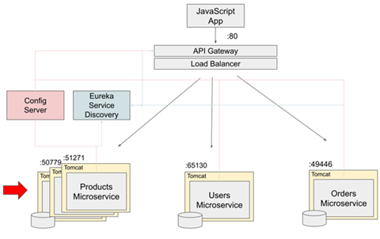

# [Event-Driven Microservices, CQRS, SAGA, Axon, Spring Boot](https://indra.udemy.com/course/spring-boot-microservices-cqrs-saga-axon-framework/)

- Curso tomado de `Udemy` del instructor `Sergey Kargopolov`.
- Aprenda a crear microservicios distribuidos basados en eventos `(Event-driven)`, `CQRS`, `Event Sourcing`, `SAGA` y
  `transactions`.

---

## Descripción general de la arquitectura de microservicios

Supongamos que has empezado a construir tu proyecto como una pequeña aplicación monolítica. Su única aplicación
monolítica se empaqueta como archivo `WAR`, se despliega en un contenedor de `Tomcat` y funciona con una única base de
datos de escala mínima.

Ahora, con el tiempo, la funcionalidad de la aplicación creció y se hizo muy grande. Su equipo decidió dividir esta gran
aplicación monolítica en microservicios más pequeños.

Cuando su aplicación se divide en varios microservicios diferentes, cada microservicio tendrá su propia base de datos,
a esto se le denomina `patrón de diseño de base de datos por servicio`. Ya no existe una única base de datos que
contenga toda la información sobre productos, usuarios y pedidos en una sola base de datos.

La información del producto estará en la base de datos de productos, la información del usuario estará en la base de
datos de usuarios, y la información del pedido estará almacenada en la base de datos de pedidos.

En caso sea necesario, los microservicios pueden ampliarse. Por ejemplo, si aumenta la carga de un microservicio, puede
ejecutar varias instancias del mismo en el mismo servidor y este será otro patrón de diseño de microservicios que se
llama `múltiples instancias de servicio por host`.

En la imagen anterior podemos ver varios patrones de diseño, como el patrón de diseño de base de datos por servicio, el
patrón de diseño de descubrimiento de servicios, el API Gateway y la configuración centralizada, y hay muchos más con
los que aún podemos encontrarnos, como por ejemplo, rastreo distribuido, circuit breaker, token de acceso, event
sourcing, CQRS, SAGA y muchos más.

## Microservicios basados en eventos (Event Driven)

La mayoría de las veces cuando dos aplicaciones necesitan comunicarse entre sí, esta comunicación suele ser en forma de
petición y respuesta. Si estas dos aplicaciones son microservicios, entonces normalmente, un microservicio enviará la
petición HTTP a otro microservicio, y luego recibirá la respuesta HTTP. Este tipo de comunicación es aplicable a muchos
casos de uso, pero no a todos.

¿Y si tenemos un `microservicio A` que necesita comunicar un mensaje a varios microservicios al mismo tiempo? La
comunicación directa de `request/response` ya no es conveniente en este caso. Si solo hay tres microservicios de
destino, entonces tal vez podamos lidiar con ello. Pero, ¿y si hay docenas de microservicios de destino que necesitan
recibir un mensaje?, ¿y si los microservicios que necesitan recibir un mensaje pueden añadirse más tarde?, ¿cuántos de
ellos se añadirán más tarde? No lo sabemos.

En este tipo de casos de uso, por ejemplo, la comunicación directa de `request/response` HTTP entre dos microservicios
ya no es útil. En este tipo de situaciones, podemos utilizar la `arquitectura basada en eventos (event-driven)`.

El `microservicio A` que necesite comunicar un mensaje a varios microservicios publicará un mensaje en un componente
`Message Broker`. Los microservicios que estén interesados en recibir este mensaje lo consumirán desde un componente
`message broker` en cuanto esté disponible allí. Este modelo suele denominarse de `productor` y `consumidor`, donde el
`microservicio A` de la izquierda es un `productor` y los microservicios de la derecha son `consumidores`.

Los microservicios están débilmente acoplados y son completamente transparentes entre sí. Puedes conectar tantos
microservicios consumidores como necesites. Sólo tienen que saber qué tipo de mensaje esperar.

Ahora bien, el mensaje que se publica y consume puede ser de distintos tipos. Puede ser un `comando`, un `evento` o una
`consulta`.

Por ejemplo, el `microservicio A` puede recibir un mensaje para hacer algo. Este mensaje puede considerarse una orden.
Cuando el `microservicio A` termine de procesar este comando, publicará un nuevo mensaje, que será un evento y entonces
todos los microservicios que estén interesados en recibir este evento y estén suscritos para recibir este evento, lo
recibirán y lo procesarán.

Y como en esta arquitectura los microservicios se comunican entre sí mediante la publicación y consumo de mensajes o
eventos, se denomina `arquitectura dirigida por mensajes` o `arquitectura dirigida por eventos`.

### ¿Qué es la arquitectura basada en eventos?

La `arquitectura basada en eventos` utiliza eventos para desencadenar y establecer comunicación entre servicios
desacoplados, y es común en las aplicaciones modernas creadas con microservicios. Un `evento` es un cambio de estado, o
una actualización, como un elemento que se coloca en un carro de compras de un sitio web de comercio electrónico. Los
eventos pueden llevar el estado (el elemento comprado, su precio y una dirección de entrega) o pueden ser
identificadores (una notificación de que se envió una orden).

La `arquitectura basada en eventos` o `event-driven architecture (EDA)` es un modelo de diseño de software en el que los
componentes del sistema interactúan entre sí a través de la emisión, recepción y procesamiento de eventos.

Un evento es cualquier cambio significativo en el estado del sistema, como `"un pedido fue creado"`,
`"un usuario actualizó su perfil"` o `"un pago fue procesado"`. En esta arquitectura, los sistemas reaccionan en tiempo
real a los eventos en lugar de operar de manera sincrónica y lineal.

### Componentes principales de una arquitectura basada en eventos

1. `Productor de eventos (Event Producer)`:
    - Genera los eventos cuando ocurre algún cambio en el sistema. Por ejemplo, una API que emite un evento cuando se
      crea un nuevo pedido.

2. `Broker de eventos (Event Broker)`:
    - Actúa como intermediario que transmite y distribuye los eventos a los consumidores interesados. Ejemplos comunes
      incluyen `Kafka`, `RabbitMQ` y `Amazon SNS/SQS`.

3. `Consumidor de eventos (Event Consumer)`:
    - Escucha y responde a los eventos emitidos. Por ejemplo, un servicio que reacciona a un evento de `"pedido creado"`
      para enviar un correo de confirmación.

4. `Eventos`:
    - Datos estructurados que representan un cambio o acción. Generalmente, son mensajes con información del evento,
      como el ID del pedido, el timestamp, etc.

## Transacciones en microservicios

En una aplicación monolítica, implementar transacciones no es muy difícil, especialmente con el soporte de spring
framework. Iniciamos la transacción, realizamos un conjunto de operaciones comerciales y, a continuación, finaliza la
transacción. Si alguno de estos pasos dentro de una misma transacción no tiene éxito, podemos lanzar una excepción y
todas las modificaciones de la base de datos que hayamos realizado se revertirán.

Se trata de una transacción de activos de `todo` o `nada` y dentro de una misma aplicación es relativamente sencilla de
implementar.

Ahora, revisemos algunas de las propiedades de la `transacción ACID` que utilizamos en la aplicación monolítica.

1. `Atomicidad`, las transacciones son atómicas, lo que significa que todas las operaciones se ejecutan con éxito o todo
   falla a la vez.
2. `Consistencia`, este principio asegura que una transacción llevará la base de datos de un estado válido a otro estado
   válido, respetando todas las reglas y restricciones definidas, como claves primarias, claves foráneas, restricciones
   únicas y validaciones. En otras palabras, después de completar una transacción, la base de datos no debe contener
   datos inválidos o inconsistentes, y debe cumplir con las reglas de integridad definidas en su esquema.
3. `Aislamiento`, la transacción que se esté ejecutando de forma concurrente no puede acceder al estado intermedio de
   otra transacción. Este principio asegura que las transacciones concurrentes no interfieran entre sí y que cada
   transacción se ejecute como si fuera la única operando en la base de datos. Aunque las transacciones pueden
   ejecutarse simultáneamente, el aislamiento garantiza que su resultado sea el mismo que si se ejecutaran de manera
   secuencial.
4. `Durabilidad`, una vez realizada la transacción, los cambios en la base de datos se almacenan de forma duradera. Si
   se produce un error o un fallo del sistema después de realizar la transacción, los cambios realizados en esta
   transacción no se revertirán.

En la arquitectura de microservicios, donde cada microservicio es una aplicación independiente con su propia base de
datos, la ejecución de transacciones de activos es mucho más difícil. Ya no se trata de una única aplicación.

El microservicio se ejecuta en diferentes servidores y se comunican entre sí a través de HTTP y ahora no hay una única
base de datos con la que trabajar. Cada microservicio trabaja con su propia base de datos. Así, para realizar una
transacción que coloque un nuevo pedido en nuestro sistema, varios microservicios tendrán que comunicarse entre sí.

Por ejemplo, un cliente realiza un pedido y el microservicio de pedidos recibe una solicitud y crea un nuevo pedido.
El microservicio de pedidos creará un nuevo registro en su propia base de datos y, si todo es correcto, enviará una
solicitud a un microservicio de productos para reservar el producto seleccionado y las existencias. El Microservicio de
productos, actualizará su propia base de datos para reservar el producto y el stock. Y si esta operación también tiene
éxito, entonces se enviará la solicitud al microservicio del usuario para obtener los detalles de pago del usuario.
Ahora, esperemos que esta operación también tenga éxito y si es así, entonces se enviará una solicitud para procesar
los datos de pago. Si esta operación falla, la solicitud termina. La operación de colocación de pedidos no tiene éxito
y acabamos con varias bases de datos en un estado incoherente. Tenemos un registro de pedido abierto en la base de datos
de pedidos y tenemos un producto reservado en la base de datos de productos. El producto no se compró y no está
disponible para que otros clientes lo compren también porque está reservado.

Para arreglar la situación necesitamos implementar un `rollback de transacciones` y esta transacción tendrá que tener
lugar entre múltiples microservicios y existen riesgos. Por ejemplo, el microservicio de productos puede fallar y
acabamos con un sistema que tiene datos en un estado no válido.

Para poder construir la lógica de negocio que se distribuye a través de múltiples microservicios y para lograr la
coherencia de datos a través de estos microservicios distribuidos podemos utilizar un `patrón de diseño` que se llama
`SAGA`.

El patrón de diseño `SAGA` es una forma de gestionar la coherencia de datos entre microservicios en escenarios de
transacciones distribuidas.

Hay dos maneras diferentes de implementar el patrón de diseño saga: `coreografía` Y `orquestación`.

